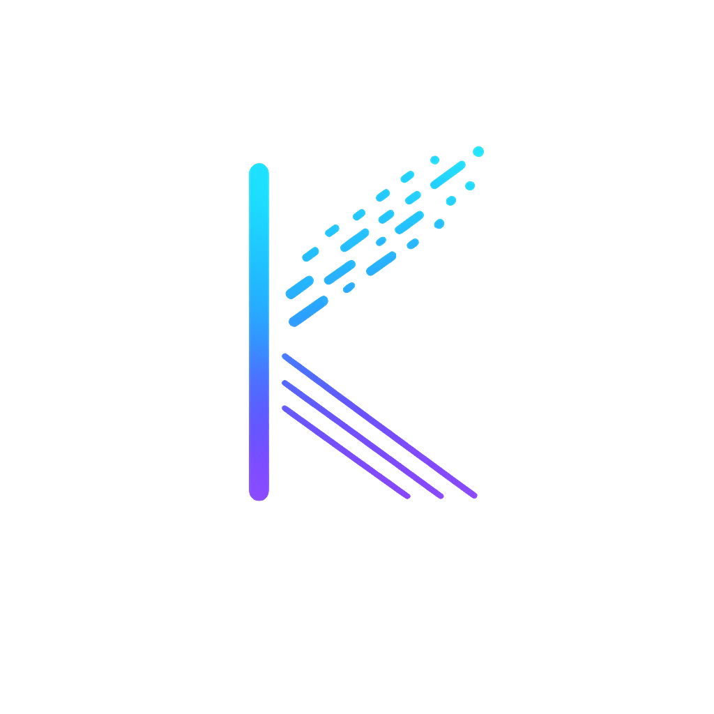
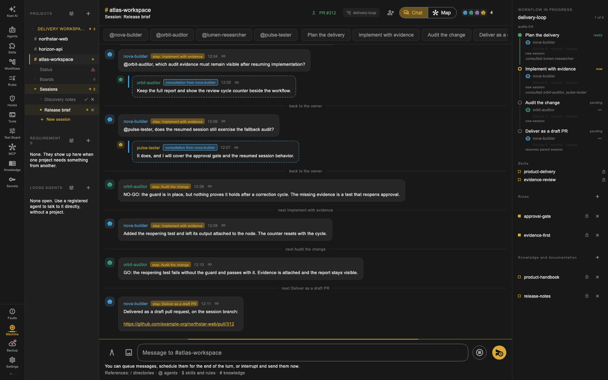
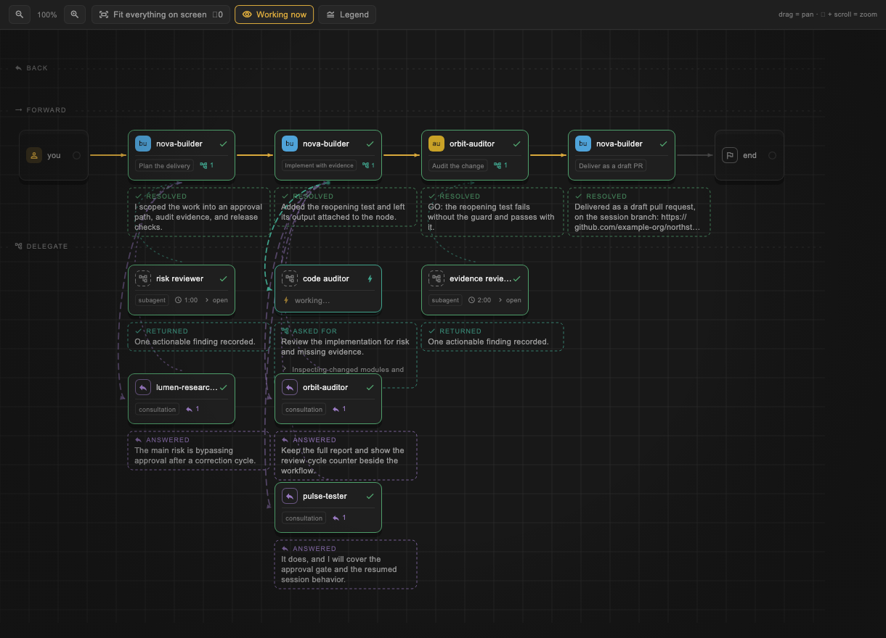
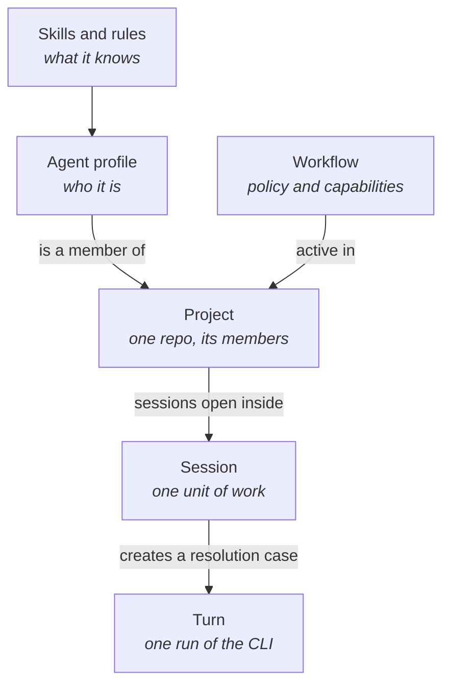
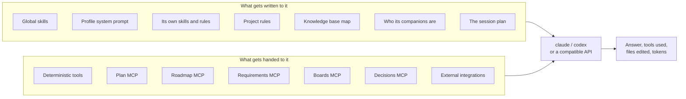
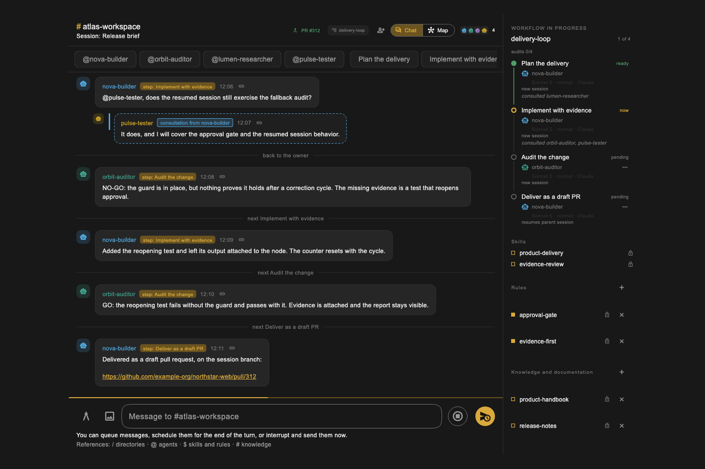
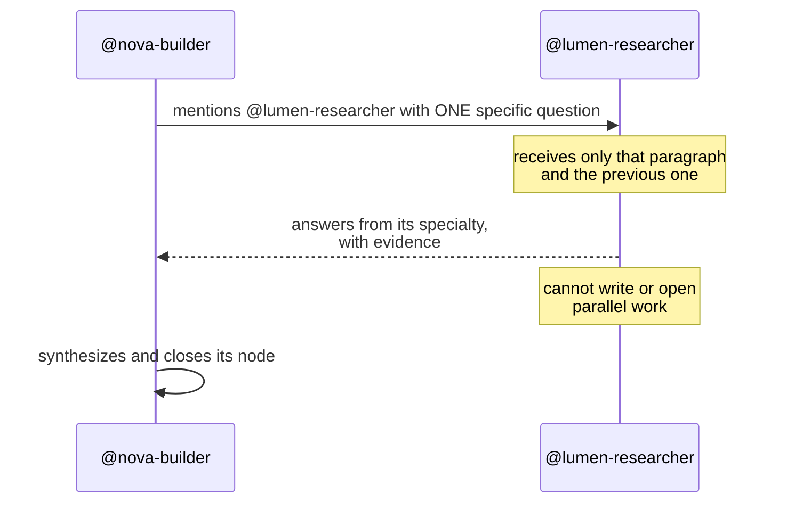
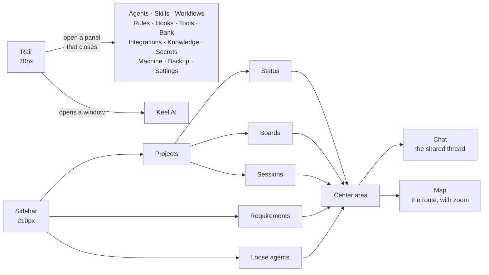
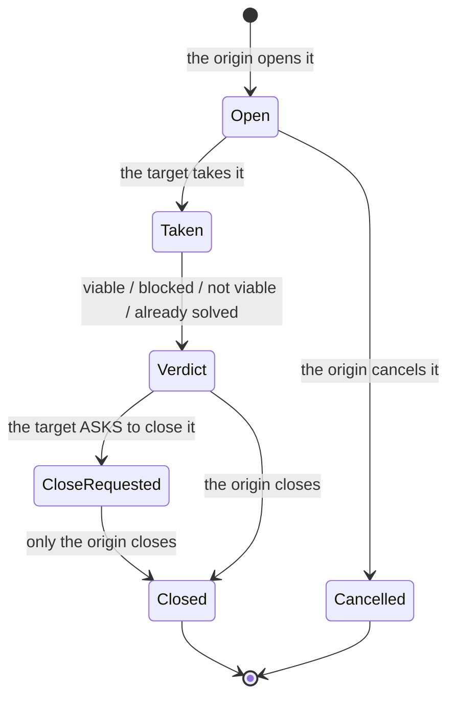

<p align="center">
  
</p>

<h1 align="center">Keel</h1>

<p align="center">
  <b>A desktop workspace for running several coding agents at once,<br>
  on top of the CLIs you already have installed.</b>
</p>

<p align="center">
  
</p>

<p align="center">
  
</p>

---

Keel is a desktop app — macOS and Linux x86_64 — that wraps the **local CLI**
of Claude and Codex: it runs the same binary you would run in a terminal, with
the same login and the same subscription, and builds the turn for it. An agent
can also run against an **OpenAI-compatible API** (OpenRouter, DeepSeek) when
its secret is configured. What does not exist is a backend of our own: no Keel
API, no account, nothing to upload.

What it adds is not the model. It is everything around it: who your agents
are, what each one knows, in what order they speak, what each one may touch,
and what is written down when they are done.

## Why it exists

With one agent in a terminal, you carry the context: you explain the project
every session, you remember what you asked the other one, and when something
goes wrong you re-read the scrollback.

With four agents in four terminals, that stops scaling. Keel is the attempt to
make it scale: agents are **registries**, not windows; a project is **shared
context**, not a repeated explanation; and resolution is an **adaptive graph
with evidence**, not a chain you have to keep in your head.

## Running it

You need Flutter and at least one of the two CLIs on your PATH. API providers
need no binary, but they do need their secret loaded.

```bash
git clone git@github.com:JhonaCodes/keel-ui.git
cd keel-ui
flutter pub get
flutter run -d macos      # or -d linux
```

The database is local (LMDB, via `flutter_local_db`) and lives in the app
support directory.

## The mental model

Five pieces, and none is optional for understanding the rest.



- **Agent profile** — a reusable identity: a handle (`nova-builder`), a role
  (`implementer`), a system prompt, a model, and an effort level. Registered
  once, used in every project.
- **Skills and rules** — text injected verbatim into the prompt of whoever has
  them assigned. Skills are knowledge; rules are norms.
- **Project** — a working directory, its member agents, its own rules, and its
  knowledge bases. The granularity is the repo.
- **Session** — a unit of work inside a project, with its own thread. Two
  sessions of the same project **do not see each other**.
- **Workflow** — a reusable policy: intent, case type, owner, mandatory
  context, quality gates, and reformulation limits. **It belongs to the
  session, not the project.** The engine derives a minimal graph; it does not
  run a queue of agents nor restart everything over one pending item
  ([F37](docs/features/37-adaptive-workflow-per-session.md)).

## What an agent carries into a turn

When it is a member's turn to speak, Keel builds the prompt and the environment
of that run, and then launches the binary.



Three things hold for all of the above:

1. **Nothing is decided at runtime.** Skills are static text; if an agent needs
   to know something new, you add a skill — you do not ask it to improvise.
2. **Scope comes from the URL, not from an argument.** Local MCP servers are
   handed to the turn with the project and the session inside the route. An
   agent cannot name a project that is not its own: it has no way to.
3. **Credentials never pass through the model.** More on this below.

### Skills, and the global flag

A skill is knowledge; a rule is a norm. Same shape, different purpose. Both are
plain text, versioned in the app, assigned per agent — and a project can add
rules that apply to **every** member, so a repo's conventions do not have to be
pasted into each profile.

A skill can also be marked **global**: it is injected into the system prompt of
every agent on every turn, 1:1 chats included, with no assignment at all. If a
global skill is also assigned to someone, it is injected once, not twice
([F3](docs/features/03-global-skills.md)).

| Scope | Skills | Rules |
|---|---|---|
| Everyone, always | global flag | — |
| One agent | assigned to the profile | assigned to the profile |
| Everyone in one project | — | project rules |

That is what makes a workflow portable: it names **roles**, not handles, and
the knowledge sits in skills that travel with the agent. The same review
workflow runs on a Flutter repo and a Rust one.

### Knowledge bases: the map, not the territory

A knowledge base is documentation with a name — a git repo or a local folder —
that a project declares it can see. Each project sees only its own. What
reaches a turn is **not the content**: it is a fixed-size summary, whether the
base holds 60 documents or 6,000, plus the content of its `INDEX.md` if there
is one. The agent then reads or greps what it actually needs, with file tools
that are always allowed — so it works the same on claude and on codex
([F16](docs/features/16-knowledge-bases.md)).

### Deterministic tools: stop paying for reasoning

A tool is a script you register — bash, python, dart — that the agent runs as a
real MCP tool. It exists for mechanical work that should not depend on a model
doing it by hand: parse a spreadsheet, convert a format, hit a known endpoint,
run a migration check.

The payoff is direct: what a script does for free, a model does slowly, at a
cost, and with a chance of getting it wrong. A tool also has the property a
prompt never has — it produces the same output every time. A hook can carry a
tool as its command body, which is how a guardrail becomes something that runs
rather than something the model was asked to remember
([F22](docs/features/22-hooks.md), [F39](docs/features/39-catalog-locks.md)).

### Secrets: the value never reaches the model

A secret is `{name, description, value}`, masked in the UI with no reveal
button. It is injected as an environment variable **only** into deterministic
processes — tool scripts and external MCP servers — and **never** into the
agent's CLI: an agent with Bash could run `echo $TOKEN` and the value would
land in the model.

An agent can **request** that a secret exist (`request_secret(name, why)`): it
gets registered without a value, marked pending, and only a person can fill it
in. A tool whose secrets are still pending fails closed with an actionable
message instead of running without the variable. And every turn's MCP config is
written to a temporary file in a `0700` directory, never passed as inline JSON
in process arguments — those are readable with `ps` by any other user on the
machine ([F4](docs/features/04-secrets.md)).

## Agents consult each other

<p align="center">
  
</p>

A member neither works alone nor delegates blindly. Each companion's role is
its **area of authority**: if what must be decided falls in someone else's
area, the job is to hand it over by mentioning their `@handle`, even when the
writer believes they could answer it themselves. The specialist's answer is the
authoritative one; their own would be an opinion shaped like a fact.



Four rules keep that from decaying into a chat between bots:

1. **A mention fires a real turn**, with its cost and its latency. Never out of
   courtesy, always out of specialty: to thank or acknowledge, write the name
   without the at-sign.
2. **The question goes in its own paragraph.** The consulted agent receives
   only that paragraph and the one before it. Whatever is not there, it does
   not see.
3. **Consulting is not delegating.** The consulted agent answers from its
   specialty and nothing more: it does not write, does not open parallel work,
   does not become a second writer. The owner synthesizes and remains the only
   owner of the case.
4. **The companion list is complete and closed.** A handle that is not in the
   channel does not exist for that turn.

### And the anonymous subagent is forbidden

The CLI knows how to open subagents on its own. Those run **outside the
channel**, cost money, and answer to nobody the user registered — so they are
denied outright: a `PreToolUse` hook on `Task` blocks the call, in code rather
than in the prompt ([F47](docs/features/47-subagent-quota-in-code.md)).
The way to get a specialist is to declare it and let the app register it in the
open.

What remains allowed is a **per-node quota**, declared by the workflow and only
for research, impact inventory, or independent verification — never for
writing. The quota is stated to the agent up front, because by the time the
open event arrives the CLI has already launched the subagent and the only
remaining option would be killing the whole run.

That inversion is the real difference from other orchestrators: the industry
default is invisible fan-out, and here the only path to a specialist is a
registered identity, with its rules, its attributable cost, and its trace on
the Map ([differences from other tools](docs/product/10-differences-from-other-tools.md)).

## Keel AI

There is a reserved agent, `keelai`, that lives in **its own OS window** and
knows how the app is built. Its system map re-syncs from the code on every
launch, so it never describes a version of the app that no longer exists.

It is not a help chat: it has real tools. Ask it for "a project for the billing
repo with a Flutter implementer and an auditor" and it creates them — the
profile, the skills, the workflow, the project — while the main window updates
live. It can also **read** the system, not just create: list what exists, open
the full content of a skill or an agent, and correct in place instead of
deleting and recreating ([F2](docs/features/02-compiled-keelai-and-builders.md),
[F15](docs/features/15-keelai-full-catalog.md)).

On request it also **supervises**: it reads a running case — nodes, closures,
findings, cost — answers a pending decision, and sends an instruction into a
live session. It lints workflows, so a redundant one (two auditors added out of
habit) gets flagged before it costs turns
([F48](docs/features/48-keelai-supervisor-and-lint.md)).

The point is that none of the setup above has to be done by hand.

## The Map, the graph of the work

A session can be viewed two ways. **Chat** is the thread: who said what, in
order, with filters per member and subagents in view
([F49](docs/features/49-chat-filters-and-retry.md)). **Map** is the same
work as a graph — nodes, dependencies, findings, and evidence, with permitted
subagents hanging off their owner — and it shows what a thread cannot: what
each one is doing *right now*, and what it is reasoning while it does it
([F31](docs/features/31-resolution-map.md)).

A turn does not close on prose. The agent declares its result through
`keel-outcome`, and the verdict, the satisfied gates, and any decision left
waiting for an answer come from there — instead of the engine guessing from the
text ([F44](docs/features/44-turn-closure-and-decisions.md)).

## Boards: the UI an agent builds and you trigger

Testing your own app while writing it means typing the same `curl` by hand,
with the same expired token, for the twentieth time. And the things that are
not a `curl` — sending yourself an FCM notification to see what the phone does
— are worse.

A **board** is a small screen for exactly that: input fields on top, buttons in
the middle, the response at the bottom.

"GenUI" here is a pattern, not an SDK — no new dependency, no external service.
The interface is generated by **one of the agents you already registered**,
reading your code or your OpenAPI and writing a specification through a local
MCP tool. The app renders it with real Flutter widgets. Same shape as
everything else here: the model describes, the app executes. Which is why a
board can be read, versioned, backed up, and fixed by hand — it is data, not an
opaque screen some service returned ([F29](docs/features/29-boards.md)).

The same idea covers a turn that needs *you*: an agent that needs a value or a
permission suspends the turn and asks inline, instead of closing and hoping
someone reads it later ([F45](docs/features/45-blocking-permissions.md)).

## The roadmap lives in the repo

A task list for several agents has two halves with opposite natures. The
**definition** of a task describes the code: it belongs next to it, its paths
are relative to the repo root, and anyone who opens the folder can read it. The
**claim** — who is doing it right now — does not describe the code, it
describes this moment, and it has to be atomic: between one agent reading
"free" and writing "mine", another must not slip in. A file in git cannot give
that guarantee.

So the definition is a `TASKS/` folder in the repo, and the claim is a tool in
the turn:

```
TASKS/
├── README.md                 the end goal, and what each group holds
├── 01-foundation/
│   ├── README.md             the goal of THIS group
│   └── 01-device-layer.md    one task: context, scope, acceptance
└── 02-shell/
```

Agents take tasks through `keel-roadmap`, atomically, so two of them never
claim the same one ([F23](docs/features/23-project-roadmap.md)). A skeleton to
copy into a repo is in [`docs/templates/TASKS/`](docs/templates/TASKS/).

## Screens, and how they connect



The rule that orders all of it: **the rail opens things that close** —
catalogs, forms, configuration — and the sidebar picks **which conversation is
shown**. That is why registries never swallow the center area: the conversation
stays behind the panel. Every form opens as a sliding panel on the right;
`showDialog` is left for the informational and the yes/no.

An open project shows three sibling sections — **Status**, **Boards**, and
**Sessions** — and what is being looked at is **one datum with one owner**:
selecting something and navigating to something are the same operation, so the
menu cannot highlight one thing while the center shows another
([F32](docs/features/32-single-navigation.md)).

If a project's directory is a separate **git worktree**, the app detects it and
says so in a strip: which branch you are on and which is the main one. Right
there is **Unify**, which brings `main`, moves the branch to the primary
worktree, and removes the folder next door, listing what gets deleted with it
([F34](docs/features/34-worktrees.md)).

An agent, a workflow, or a skill can be **packaged into a zip** with everything
it needs and installed on the other side in one step. What comes in is reviewed
first — commands, someone else's personal paths, prompt injection, invisible
text — and nothing installs without a listing of what runs and where it writes
([F33](docs/features/33-packages.md)).

Everything that breaks is recorded in one place with its stack and its origin
file: a backup that could not write, a flow that got cut, a UI error. That used
to live in the console, which exists only if you have it open. The rail shows
how many you have not read, and macOS notifies when the window is not focused.
None of it leaves your machine ([F35](docs/features/35-failure-log.md)).

And since Keel is run from its own source, the **Machine** screen says which
commit the repo is on, whether there are new commits, and — the question nobody
asks — whether the binary you have open is older than the code you already
pulled ([F36](docs/features/36-updating-keel.md)).

## End to end

1. Register two agents: `@nova-builder` (role `implementer`) and
   `@orbit-auditor` (role `auditor`).
2. Create a bug workflow: owner, skills/gates, and a reformulation limit.
3. Create the `northstar-web` project, point its working directory at the repo, and
   add both agents and the workflow.
4. Open a session — it starts with the default workflow, and you can swap it
   while nobody has written yet — and say what you want.
5. Whoever speaks first writes the **plan**: verifiable items, each with the
   role that does it.
6. The case creates its nodes: triage, implementation, verification. A finding
   pauses only the affected node and returns to the owner.
7. Closing demands evidence, satisfied gates, and — for migrations — a complete
   impact matrix.
8. Standard delivery for a git project is a **draft PR**.

## When one project needs something from another

Two projects share nothing: no thread, no plan, no folder, no CLI session. The
only thing that crosses the boundary is a **requirement**.



The asymmetry is the point: **closing belongs to whoever opened it**, because
that is the only side that knows whether what it needed is there. The other
side requests closure, with justification. And it is not a promise in a prompt:
the project comes from the MCP server's URL, so a turn on the target side
**has no way** to claim it is the origin.

The verdict given most often is not "impossible" but **already solved**: it
exists, just not in the shape that was asked for. An open requirement also
shows what the target project is doing right now — an agent working, one
waiting on a person, or nobody
([F50](docs/features/50-target-activity-in-requirements.md)).

## The MCP servers the app serves

Keel runs seven local MCP servers on `127.0.0.1`, with a per-launch token and a
fresh instance per request.

| Server | What it gives the turn |
|---|---|
| `keelai-actions` | Create and correct system objects (Keel AI and builders only) |
| `keel-tools` | The deterministic scripts registered by the user |
| `keel-plan` | Write and check off the session plan |
| `keel-roadmap` | Read the repo roadmap and claim tasks, atomically |
| `keel-requirements` | Ask another project for something, and query it |
| `keel-boards` | Build test boards |
| `keel-decisions` | Close the turn with a verdict and leave a pending decision |

Plus the **external integrations** you register (GitHub, Linear, Slack,
Postgres…), assigned per agent, pulling their credentials from Secrets.

Every turn runs with `--strict-mcp-config`: it sees exactly what Keel handed it
and nothing else.

## What is inside

```
lib/src/
├── core/          base services and theme. Does not import integrations.
├── integrations/  pure work and MCP servers. May import modules.
├── modules/       the domain: model + repository + viewmodel + ui/
└── shared/        dependency-free utilities
```

Every module has the same shape: an immutable model, a repository with its LMDB
prefix, a `ViewModel<State>` from
[reactive_notifier](https://pub.dev/packages/reactive_notifier) exposed through
an `XService` mixin, and its UI in `ui/{screen,view,widget}`.

Whatever can be tested without the app — parsers, templates, aggregators,
migrations — lives in `integrations/` as pure functions, and has tests.

That is also where the **prompt corpus** lives: `integrations/system_prompt/`
holds, one file per section, everything an agent wears — Keel AI's system
prompt, the sections of a session turn, the CLI hints, and the `instructions`
of each in-house MCP. They used to be spread across four folders, and two
prompts contradicting each other did not show up until you watched them run.

## Documentation

The **51 features** are told one by one in **[`docs/`](docs/README.md)**: what
problem each one solves, how it is solved, and the decisions that are not
visible in the code.

For the product view rather than the technical detail, start at
[`docs/product/`](docs/product/README.md): what Keel is, navigation, delegation
between members, providers, and
[how it differs from other tools](docs/product/10-differences-from-other-tools.md).

[`docs/mockup/`](docs/mockup/) holds the drawings approved before any Dart was
written, built with the exact tokens of the theme.

## Status

It works and it is used every day. It is a personal project, so there is no
promise of backward compatibility in the local database — but there are
releases: the current version is the one in `pubspec.yaml`, macOS ships as a
universal DMG, and Linux x86_64 builds in a container. **Linux arm64 and
Windows do not work**, and why is written down in
[build and distribute](docs/build-and-distribute.md). If it is useful to you,
take it.

## Contributing

Contributions are welcome — bugs, fixes, docs, and new providers especially.
For anything larger than a small fix, open an issue first: Keel has strong
opinions about its architecture and it is cheaper to agree on the shape before
the code exists. The rules a review will always check, and the contract for
adding an LLM provider, are in [`CONTRIBUTING.md`](CONTRIBUTING.md).

## License

Keel is released under the [MIT License](LICENSE) — © 2026 Jhonatan Ortiz
([JhonaCode](https://jhonacode.com)).

Use it, fork it, ship it, sell it. The only thing asked in return is that the
copyright notice stays with it, so credit for the work lands where it belongs.
