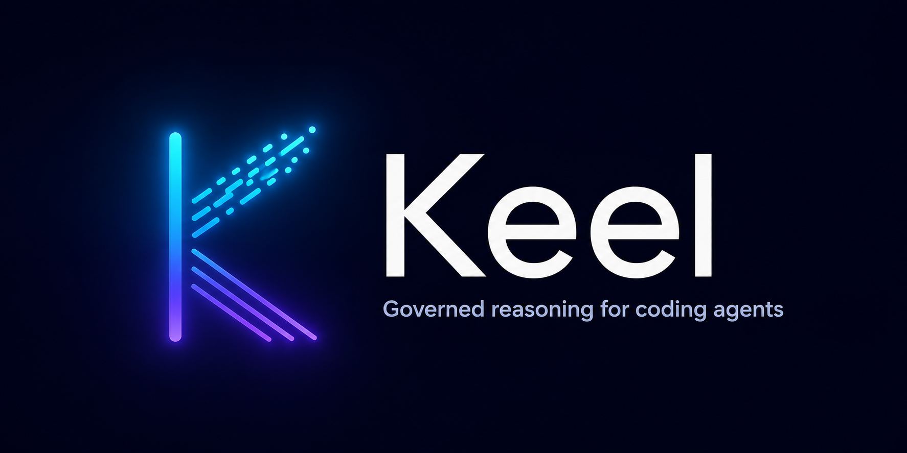
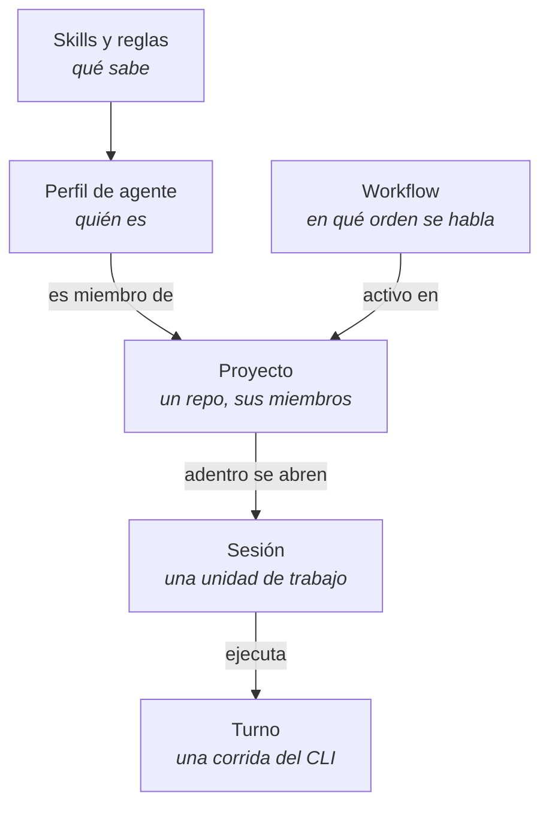
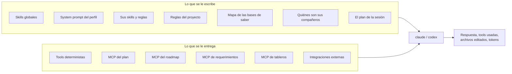
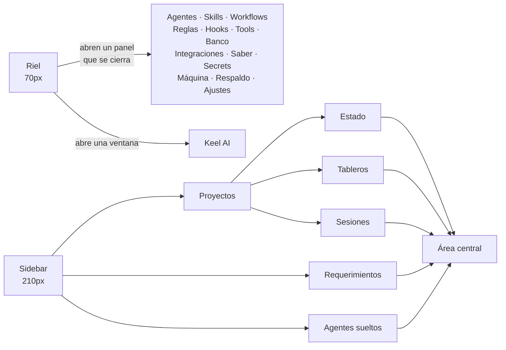
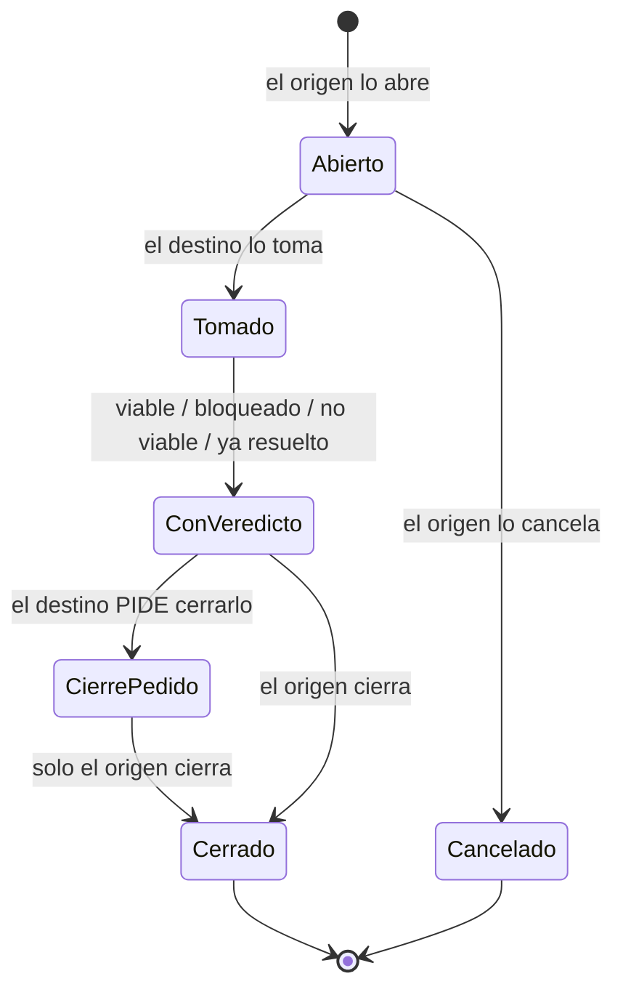

<p align="center">
  
</p>

<p align="center">
  <b>Un escritorio para trabajar con varios agentes de código a la vez,<br>
  sobre los CLI que ya tenés instalados.</b>
</p>

---

Keel es una app de escritorio para macOS que envuelve el **CLI local** de
Claude y de Codex. No habla con ninguna API: larga el mismo binario que
correrías en una terminal, con el mismo login y la misma suscripción, y le
arma el turno.

Lo que agrega no es el modelo. Es todo lo de alrededor: quiénes son tus
agentes, qué sabe cada uno, en qué orden hablan, qué puede tocar cada uno, y
qué queda escrito cuando terminaron.

## Por qué existe

Con un agente en una terminal, el contexto lo llevás vos: le explicás el
proyecto en cada sesión, te acordás de qué le pediste al otro, y cuando algo
sale mal releés el scrollback.

Con cuatro agentes en cuatro terminales, eso no escala. Keel es el intento de
que sí: los agentes son **registros**, no ventanas; el proyecto es **un
contexto compartido**, no una explicación repetida; y el orden en que hablan
es **un workflow**, no tu memoria.

## Cómo se corre

Hace falta Flutter y por lo menos uno de los dos CLI en el PATH.

```bash
git clone git@github.com:JhonaCodes/keel-ui.git
cd keel-ui
flutter pub get
flutter run -d macos
```

La base de datos es local (LMDB, vía `flutter_local_db`) y vive en el
directorio de soporte de la app. No hay servidor, no hay cuenta, no hay nada
que subir.

## El modelo mental

Cinco piezas, y ninguna es opcional para entender el resto.



- **Perfil de agente** — una identidad reusable: un handle
  (`flutter-expert`), un rol (`implementador`), un system prompt, un modelo y
  un esfuerzo. Se registra una vez y sirve en todos los proyectos.
- **Skills y reglas** — texto que se inyecta tal cual en el prompt de quien
  las tenga asignadas. Las skills son conocimiento; las reglas, normas.
- **Proyecto** — un directorio de trabajo, sus agentes miembros, sus reglas
  propias y sus bases de saber. La granularidad es el repo.
- **Sesión** — una unidad de trabajo adentro de un proyecto, con su propio
  hilo. Dos sesiones del mismo proyecto **no se ven** entre sí.
- **Workflow** — pasos ordenados, cada uno con el ROL que le toca. Por eso el
  mismo workflow sirve en un proyecto Flutter y en uno de Rust: el paso dice
  "revisor", no "@dart-expert".

## Cómo se arma un turno

Esto es el corazón: cuando le toca hablar a un miembro, Keel construye el
prompt y el entorno de esa corrida, y después larga el binario.



Tres cosas que valen para todo lo de arriba:

1. **Nada se decide en runtime.** Las skills son texto estático; si el
   agente necesita saber algo nuevo, se le agrega una skill, no se le pide
   que improvise.
2. **El alcance sale de la URL, no de un argumento.** Los servidores MCP
   locales se le entregan al turno con el proyecto y la sesión adentro de la
   ruta. Un agente no puede nombrar un proyecto que no es el suyo: no tiene
   cómo.
3. **Las credenciales no pasan por el modelo.** Los secrets se referencian
   por nombre y se resuelven recién adentro de un archivo temporal `0700`,
   nunca en argv —que se lee con `ps`— ni en el prompt.

## Keel AI

Hay un agente reservado, `keelai`, que vive en **su propia ventana** del
sistema operativo y sabe cómo está armada la app.

No es un chat de ayuda: tiene tools reales. Le pedís "armame un proyecto para
el repo de facturación con un implementador Flutter y un auditor" y lo crea —
el perfil, las skills, el workflow, el proyecto— mientras la ventana
principal se actualiza en vivo.

Su mapa del sistema se re-sincroniza en cada arranque desde el código, así
que nunca describe una versión de la app que ya no existe.

## Las pantallas, y cómo se conectan



La regla que ordena todo eso: **el riel abre cosas que se cierran**
—catálogos, formularios, configuración— y el sidebar elige **qué conversación
se ve**. Por eso los registros nunca se tragan el área central: la
conversación se queda atrás del panel.

Todo formulario abre como panel deslizante a la derecha; `showDialog` queda
para lo informativo y para el sí/no.

## Un ejemplo de punta a punta

1. Registrás dos agentes: `@flutter-expert` (rol `implementador`) y
   `@code-auditor` (rol `auditor`).
2. Creás un workflow de dos pasos: *implementar* → *auditar*, por rol.
3. Creás el proyecto `mi-app`, apuntás su directorio de trabajo al repo,
   sumás los dos agentes y activás el workflow.
4. Abrís una sesión y escribís qué querés.
5. El primero que habla escribe el **plan**: puntos verificables, cada uno
   con el puesto que lo hace.
6. Cada paso corre en su turno. Lo que edita queda con su diff en el hilo.
7. El cierre se decide **contra el plan**, no contra los pasos: si quedan
   puntos sin cumplir, va una vuelta de verificación contra el código.
8. La entrega estándar de un proyecto con git es un **PR en draft**.

## Cuando un proyecto necesita algo de otro

Dos proyectos no comparten nada: ni hilo, ni plan, ni carpeta, ni sesión de
CLI. Lo único que cruza la frontera es un **requerimiento**.



La asimetría es el punto: **cerrar es de quien lo abrió**, porque es el único
que sabe si lo que necesitaba está. Del otro lado se pide el cierre, con
justificación. Y no es una promesa en un prompt: el proyecto sale de la URL
del servidor MCP, así que un turno del destino **no tiene cómo** decir que es
el origen.

El veredicto que más se da no es "no se puede" sino **ya resuelto**: existe,
pero de otra forma que la que pidieron.

## Los servidores MCP que sirve la app

Keel corre seis servidores MCP locales en `127.0.0.1`, con un token por
arranque y una instancia nueva por request.

| Servidor | Qué le da al turno |
|---|---|
| `keelai-actions` | Crear y corregir cosas del sistema (solo Keel AI y los constructores) |
| `keel-tools` | Los scripts deterministas registrados por el usuario |
| `keel-plan` | Escribir y marcar el plan de la sesión |
| `keel-roadmap` | Leer el roadmap del repo y tomar tareas, atómicamente |
| `keel-requirements` | Pedirle cosas a otro proyecto, y preguntarle |
| `keel-boards` | Armar tableros de prueba |

Más las **integraciones externas** que registres (GitHub, Linear, Slack,
Postgres…), que se asignan por agente y traen sus credenciales desde Secrets.

Cada turno corre con `--strict-mcp-config`: ve exactamente lo que Keel le
entregó y nada más.

## Qué hay adentro

```
lib/src/
├── core/          servicios base y tema. No importa integrations.
├── integrations/  trabajo puro y servidores MCP. Puede importar modules.
├── modules/       el dominio: modelo + repositorio + viewmodel + ui/
└── shared/        utilidades sin dependencias
```

Cada módulo tiene la misma forma: un modelo inmutable, un repositorio con su
prefijo en LMDB, un `ViewModel<Estado>` de
[reactive_notifier](https://pub.dev/packages/reactive_notifier) expuesto por
un `mixin XService`, y su UI en `ui/{screen,view,widget}`.

Lo que se puede probar sin la app —parsers, plantillas, agregadores,
migraciones— vive en `integrations/` como funciones puras, y tiene pruebas.

## La documentación

Las treinta features están contadas una por una en
**[`docs/`](docs/README.md)**: qué problema resuelve cada una, cómo está
resuelta, y las decisiones que no se ven en el código.

Y en [`docs/mockup/`](docs/mockup/) están los dos dibujos que se aprobaron
antes de escribir Dart, hechos con los tokens exactos del tema.

## Estado

Funciona y se usa todos los días, pero es un proyecto personal: **solo
macOS**, sin instalador, sin versionado y sin promesa de compatibilidad hacia
atrás en la base local. Si te sirve, llevátelo.
