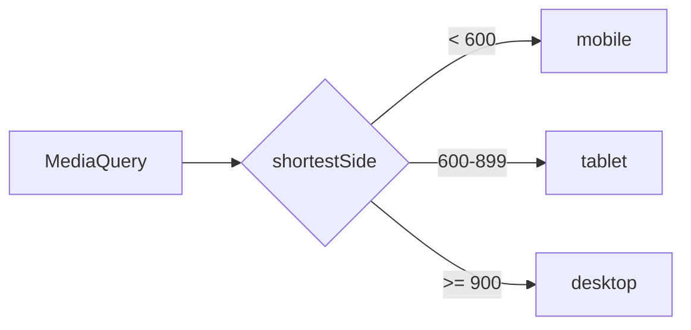

# Capa de dispositivo

## Qué hay que hacer

El detalle completo, escrito para alguien que no estuvo en la conversación
donde salió esto. Si hace falta un diagrama, va acá:

## Bloqueantes

Cada línea es `- [ ] <ruta de la tarea> — <por qué bloquea>`. La
justificación no es decorativa: sin ella nadie sabe si el bloqueo sigue
vigente. Se marca con `x` cuando se resuelve.

- [ ] 01-nombre-alusivo/00-otra.md — sin eso no hay dónde apoyar esto

## Criterio de aceptación

Cómo se sabe que está terminada. Verificable, no "quedó lindo".

- [ ] …
