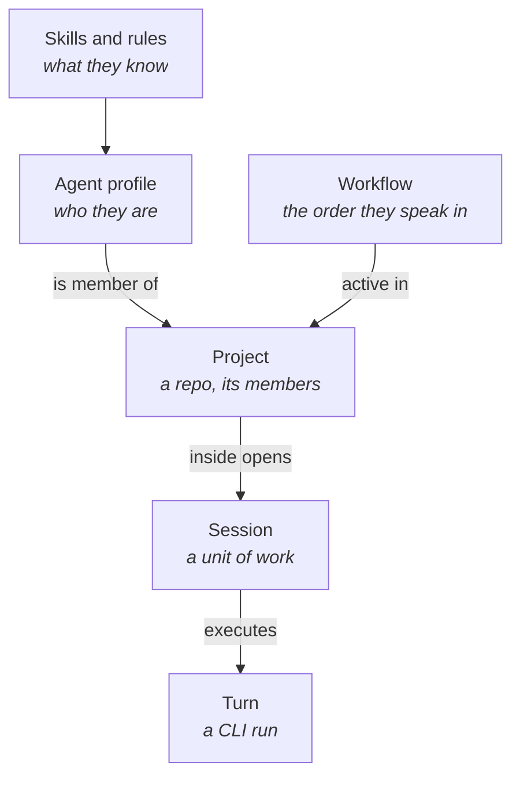

# 01 — What is Keel

## In one sentence

Keel is a macOS desktop app that wraps the **local CLI** of Claude and Codex — it doesn't talk to any proprietary API, it runs the same binary you'd use in a terminal, with the same login and the same subscription — and adds everything needed to coordinate multiple agents, multiple projects, and a large team without one person having to carry the context in their head.

What Keel adds is not the model. It is **who your agents are, what each one knows, in what order they speak, what each can touch, and what is written down when they finish**.

## For whom

For someone who:

- manages **more than one code project** at a time (different repos, sometimes different stacks);
- wants to delegate work to **multiple agents** with defined roles, not talk to a generic assistant;
- needs an agent's work to be **repeatable consistently** (the same review process across all projects);
- wants two projects to be able to ask things of each other without mixing their context;
- needs to take or share complete configuration (an agent, a workflow, a skill) as a portable unit.

## Why it exists

With one agent in a terminal, the person carries the context: you have to re-explain the project in each new session, remember what you asked the other agent, and when something goes wrong, reread the scrollback.

With multiple agents in multiple terminals, that doesn't scale. Keel aims for it to scale, with three fundamental changes:

- agents are **records**, not terminal windows — they are configured once and reused across all projects;
- the project is **a shared context**, not an explanation you have to repeat each time you open a new session;
- the capabilities, context, dependencies, and evidence policy are a **workflow** — reusable intent from which Keel builds the minimum graph for each case.

## Design philosophy

Five design decisions repeat throughout the app and are worth keeping in mind before reading the rest of this folder:

**Delegate, don't repeat context.** A project saves its member agents, its rules, and its knowledge bases; opening a new session doesn't require re-explaining any of that.

**Nothing is decided at runtime inside the prompt.** Skills are static text: if an agent needs to know something new, you add a skill to it, you don't ask it to improvise.

**Scope comes from the URL, not from what the model says.** The local MCP servers that Keel delivers to a turn carry the project and session inside the route. An agent can't name a project that isn't theirs because it has no way to — the restriction is mechanical, not an instruction it could be asked to ignore.

**Credentials don't pass through the model.** Secrets are referenced by name in configuration and are resolved only inside a temporary `0700` file, never in the prompt or process arguments — which would be readable with `ps` ([see F4](../features/04-secrets.md)).

**Roles, not people.** A workflow points to a **role** (`implementer`, `reviewer`, `auditor`), not a specific handle. That's why the same workflow works in both a Flutter project and a Rust one: what changes is who holds the role in each project, not the process itself.

## The five pieces of the mental model

- **Agent profile** — a reusable identity: handle (`domain-expert`), role (`implementer`), system prompt, model and effort by default, and provider (Claude, Codex, OpenRouter, or DeepSeek). Registered once and serves in all projects.
- **Skills and rules** — text injected as-is into the prompt of whoever has them assigned. Skills are knowledge; rules are norms.
- **Project** — a working directory, its member agents, its own rules, and its knowledge bases. The granularity is the repo.
- **Session** — a unit of work inside a project, with its own thread. Two sessions of the same project don't see each other.
- **Adaptive workflow** — intent, case type, resolution owner, mandatory context, quality gates, and bounded reformulation. It belongs to the **session**, not the project; the engine derives a minimal graph rather than an ordered agent chain ([see F37](../features/37-un-workflow-por-sesion.md)).

## Keel AI, the agent that administers the system

There is a reserved agent, `keelai`, that lives in its own operating system window and knows how the app is built — its map is re-synced at each startup from the code, so it never describes a version of the app that no longer exists ([see F1](../features/01-ventana-asistente.md), [F2](../features/02-keelai-compilado-y-constructores.md)).

It is not a help chat: it has real tools. Ask it "build me a project for the billing repo with a Flutter implementer and an auditor" and it creates it for real — the profile, the skills, the workflow, the project — while the main window updates live. And it can **read** the state of the system, not just create: list what exists, see the complete content of a skill or an agent, and fix without deleting and recreating ([see F15](../features/15-keelai-ojos-abiertos.md)).

## What runs underneath

Each agent runs on a real CLI, `claude` or `codex`, with the same session and subscription you'd use in a terminal. Keel builds the prompt, the environment, and the tools for that run, then launches the binary. None of that goes through a Keel server: there is no account, no backend, the database is local (LMDB) and lives in the app's support directory.

## Next step

To see how this translates to concrete screens, continue with [02 — Front-end and navigation](02-front-end-and-navigation.md).
