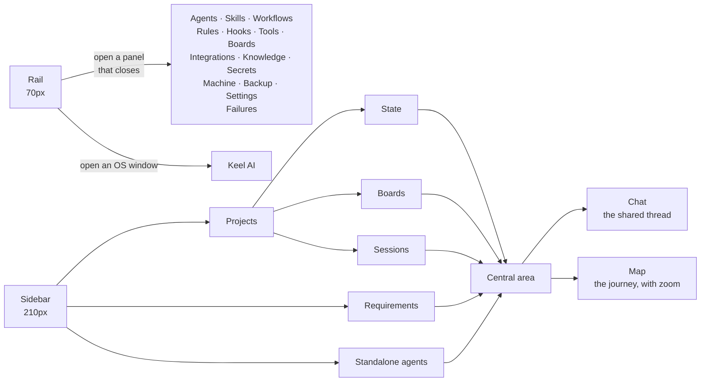
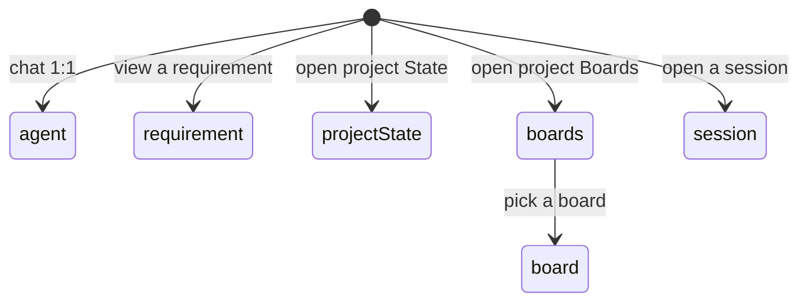

# 02 — Front-end and navigation

## The general layout

The main window has three strips: a narrow **rail** on the left, a **sidebar** beside it, and the **central area** that takes up the rest. Keel AI lives separately, in its own operating system window.

The rule that orders everything: **the rail opens things that close** — catalogs, forms, settings —, and the **sidebar picks which conversation is shown**. That's why records (skills, agents, rules...) never take over the central area: the conversation stays behind the panel you opened from the rail.

Every form opens as a **sliding panel to the right**; modal dialogs are reserved for information and yes/no confirmations.

## One piece of data, one owner: the lens

What is shown in the central area is **a single piece of data with a single owner** (WorkspaceViewModel), not something each screen deduces on its own. Before this, a board open and a click on a session did nothing — the menu marked the session but the center kept showing the board. Now selecting something and navigating to something are the same operation ([see F32](../features/32-single-navigation.md)):

An open project always shows **three sibling sections** in the sidebar — State, Boards, and Sessions —, written with the same widget so they read as equals ([see F32](../features/32-single-navigation.md)). To see this on a real screen, open `../mockup/proyectos-y-requerimientos.html`.

## Chat 1:1 vs project

There are two ways to talk with an agent:

- **Chat 1:1** — a registered agent, outside any project. Good for ad-hoc questions or the "oracle" case: an agent whose job is to answer from a knowledge base ([see F16](../features/16-knowledge-bases.md)).
- **Project channel** — the thread of a session, where the resolution owner and any bounded contributors work through the active adaptive case.

Keel AI is a special case: its sessions don't appear in either agent list (neither the rail nor "Standalone agents" in the sidebar) — it lives only in its floating window, to not mix with the agents the person registered ([see F1](../features/01-assistant-window.md)).

All conversational content is interpreted as Markdown. Long fenced blocks
stay compact in the thread and **View** chooses the matching representation:
`markdown`, `text`, and `plaintext` render as documents; Keel declarations
(`workflow`, `proyecto`, `agente`, `skill`, `regla`, `plan`, `cumplido`, and
`cobertura`) become Markdown cards with fields, lists, and capabilities; source
code keeps a monospaced viewer with language-aware highlighting. Aliases such
as `js`, `ts`, `py`, `sh`, and `yml` are normalized before highlighting. The
viewer preserves the exact fenced source and wraps long lines to the panel
width, so content never disappears beyond an invisible horizontal scroll.

## Chat vs Map

A project session is viewed two ways, with the same underlying information but a different angle:

- **Chat** is the thread: who said what, in order.
- **Map** is the same work as a graph — resolution nodes, dependencies, findings, evidence, and bounded subagents — and shows what the thread can't: what is active and why ([see F31](../features/31-resolution-map.md), complete detail in [04 — Delegation and teams](04-delegation-and-teams.md)).

To see the real drawing of this screen, open `../mockup/mapa-de-razonamiento.html`.

## Writing while the agent works

The composer doesn't block during a turn. In project sessions, writing while
agents are responding creates a visible, persisted standby message with any
attached images. It can be edited, deleted, sent after the current turn, or
sent now ([see F14](../features/14-message-queue.md)).

Both CLIs are one-shot per turn, so **Send now** cancels the current process,
waits until it actually releases the session, and only then opens the queued
message as a new turn. Manual standby messages never fire merely because the
user pressed **Stop**. Queues are available in 1:1 chat, Keel AI, and project
sessions.

## Explicit references in a project session

The session composer filters real project resources as soon as a prefix is
typed: `/` links a project directory, `@` selects a member agent, `$` links a
registered skill or rule, and `#` links a knowledge base or one of its indexed
documents. The menu supports mouse, arrow keys, Enter/Tab, and Escape.

Selections for directories, instructions, and knowledge are persisted as
readable Markdown backed by typed `keel://` links. At delivery time, Keel
resolves only those explicit links into bounded prompt context and rejects any
directory escape. An explicit `@member` routes a follow-up to that project
member; it never imports an agent from another project or bypasses workflow
preflight on the first message ([see F38](../features/38-chat-references.md)).

## Images in chat

Dropped directly on the conversation area (or with the composer button). Each attachment shows as a card preview (200×140), never full-size, and opens large on click. The image is copied to the app's storage before being shown — so it survives if the original file moves or is deleted — and reaches the model **by path**, not by bytes: the agent reads it with its own `Read` tool when it decides it needs to look at it ([see F13](../features/13-images-in-chat.md)).

This works in 1:1 chat, the Keel AI window, and project sessions.

## Clickable links and the session's PR

URLs that an agent leaves bare in their response (for example, output from `gh pr create`) become clickable automatically, except inside code blocks and except if they're not `http(s)`. If any message in the session names a GitHub pull request, the session header shows its number (`PR #N`) with a direct click — read from messages, not a separate field, because a separate field is a second place where that data could get stale ([see F19](../features/19-links-and-session-pr.md)).

## Multi-window

Keel AI runs on **a different Flutter engine**, separate from the main window: it is a presentation client — it doesn't have its own `AgentsViewModel`, doesn't open the local database, doesn't start MCP servers — that renders what the main window pushes to it and returns intentions through a native channel. This is what lets it mutate the main app live while conversing with it, without duplicating heavy state ([see F0](../features/00-multi-window-foundation.md), [F1](../features/01-assistant-window.md)).

## Git worktrees

If a project's working directory is a **separate worktree** (another folder of the same repo, on another branch, to work two things at once), the app detects it by itself — without any checkbox — and says so in a strip above what you're looking at: what branch you're on and what the main worktree is. Right there is **Unify**, which brings the base branch to the main one, moves the work branch, and removes the other folder, with a list of what gets deleted with it before touching anything ([see F34](../features/34-worktrees.md), more detail in [03 — Projects, sessions, and workflows](03-projects-sessions-and-workflows.md)).

## The failures log

A record in the rail, with the count of unseen failures, groups **everything** that breaks in the app — a backup that couldn't write, a flow that cut off, an interface error — in one place with its stack and where it came from. Before this only lived in the console, which exists only if the app was opened from a terminal. If the window isn't focused, it also alerts with a macOS notification. None of this leaves the machine ([see F35](../features/35-failure-log.md)).

## Next step

For detail on how work is organized inside a project, continue with [03 — Projects, sessions, and workflows](03-projects-sessions-and-workflows.md).
