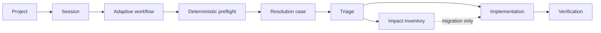

# 03 — Projects, sessions, and adaptive workflows

A **project** is a working directory plus its members, rules, knowledge bases,
and available workflows. A **session** is one isolated unit of work inside that
project. A session selects a workflow before it starts; that selection is fixed
once a resolution case exists.

## Workflows describe policy, not a queue

The persisted `Workflow` model is now an adaptive workflow. It declares:

- intent (`whenToApply`) and kind (`general`, `bug`, `migration`, `roadmap`);
- one resolution-owner role;
- adaptive capabilities with a stable ID, title, instruction, default role,
  dependencies, and `required` or `optional` activation;
- mandatory skills, rules, and knowledge bases;
- quality gates, the replan limit, and the subagent limit.

It does **not** store ordered agent steps. Required capabilities create the
initial graph; optional ones remain available until evidence activates them.
The right rail can activate an available capability explicitly; this adds one
node to the existing case and never restarts validated work.

## Preflight and ownership

Before a CLI turn costs tokens, preflight verifies that the selected workflow's
required skills, rules, knowledge bases, and owner role exist. The session
shows what was injected. Missing mandatory context blocks the case before any
agent runs. Injected and missing items are persisted in the resolution case,
so execution, Map, and the right rail cannot disagree about preflight.

Each case has one integration owner. Every instantiated node persists the
concrete assigned profile. The workflow supplies the default role and a project
may override `workflowId → nodeId → profileId` without changing the shared
workflow. Running and completed nodes keep their owner for traceability.

## Resolution graph and findings

`ResolutionCase` persists its nodes, evidence, findings, dependencies, and
state. A normal bug uses triage → implementation → verification. A migration
adds an impact node and a mandatory coverage matrix for model, serialization,
persistence, existing data, callers, compatibility, tests, and UI.

Compiler, linter, test, contract, or review evidence becomes a structured
`Finding`. It pauses only the affected node and returns it to the owner for a
reformulation. The same evidence fingerprint cannot be retried without a
meaningful change. After the configured limit (two by default), the case is
blocked with the evidence and the decision required to proceed.

There is no global restart, no positional execution cursor, and no
“Continue workflow” action. Ready nodes run from satisfied dependencies;
already validated nodes do not run again.

## Completion

A case finishes only when all graph nodes are complete, all findings are
resolved, and—when it is a migration—every coverage row is satisfied or marked
not applicable with a recorded rationale. The session Map displays the graph,
concrete owner, evidence, dependencies, and subagents beneath their parent
node. The 272 px right panel keeps the original rail presentation: status,
agent, provider/model/effort, consultations, findings, rules, skills, and
knowledge. Visual rows are capabilities, not a positional execution cursor.

When stored workflows need this schema, Keel first writes a dated raw archive
outside the active catalog, then rewrites each workflow in place. Names,
instructions, and agent roles remain visible as capabilities; only diagnosis,
implementation, and closure are required by default, while specialist reviews
remain optional. The archive is never executable.

## Workflow deletion

Deleting a workflow is a cascading domain operation. It removes the catalog
entry together with every project assignment, active default, per-capability
override, and session reference to that workflow. A session keeps its messages,
evidence, and materialized `ResolutionCase`; only the catalog ID that can no
longer resolve is cleared. If another assigned workflow remains, it becomes the
project default. Project loading also repairs and persists dangling workflow
references written by older versions.

## Worktrees, delivery, and roadmap

Worktree detection, draft-PR delivery, and the `TASKS/` roadmap remain project
capabilities. They are not execution phases: an adaptive node uses them only
when its evidence requires them. See [F34](../features/34-worktrees.md),
[F19](../features/19-links-and-session-pr.md), and [F23](../features/23-project-roadmap.md).

## Next step

See [04 — Delegation and teams](04-delegation-and-teams.md) for delegation,
provider policy, and map visibility.
