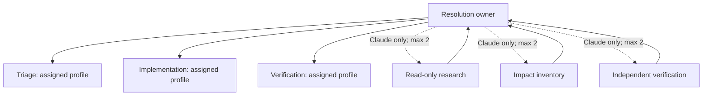

# 04 — Delegation and teams

## One owner, bounded contributors

An adaptive resolution case has a single owner selected from the workflow's
resolution role. The owner is accountable for the complete result. Each node
can persist a different assigned profile, while only one main writer is active
at a time and internal subagents remain read-only. This avoids a chain where a
finding is visible to a reviewer but belongs to nobody who can reformulate and
fix it.

## Provider policy

Subagents are optional, not a mandatory layer of coordination.

- Claude may open at most the workflow limit (two by default).
- They are limited to research, impact inventory, or verification.
- They do not edit the workspace; their output is explicitly synthesized by
  the owner.
- Codex and providers without equivalent delegation run the same graph without
  internal delegation.

Mentions between project members remain bounded consultations. They are not a
handoff and cannot create a second writer or advance an unrelated node.

## Map and evidence

The session Map positions resolution nodes by dependency depth, not a
predetermined list or positional index. It renders the persisted concrete
owner, dependencies, active state, findings, evidence, and permitted subagent
work. A repeated role does not manufacture repeated turns; one node exists
because the case needs that capability.

## Failure handling

A compiler, linter, test, contract, or review failure is a finding. The engine
pauses the affected node, assigns the finding to the owner, and schedules only
the dependency-safe correction. Repeating an identical failure without code,
context, or plan change is rejected rather than spending another turn.

## Next step

See [05 — Multiple projects](05-multiple-projects.md) for boundaries between
projects.
