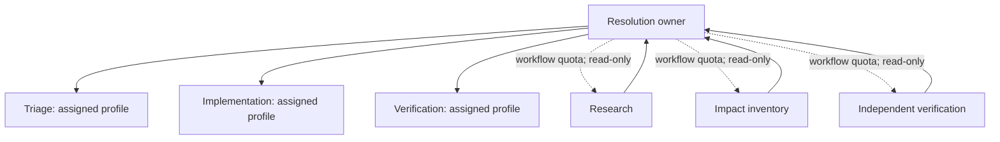
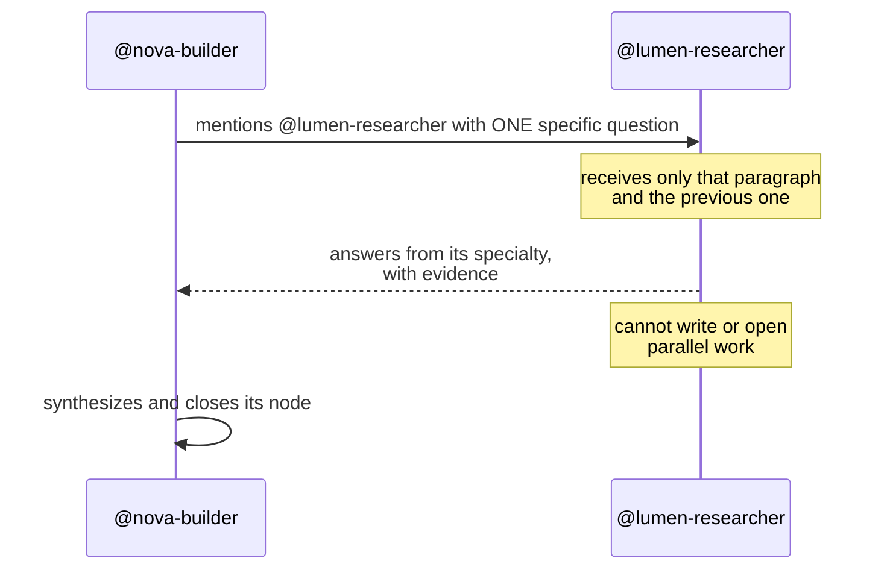

# 04 — Delegation and teams

## One owner, bounded contributors

An adaptive resolution case has a single owner selected from the workflow's
resolution role. The owner is accountable for the complete result. Each node
can persist a different assigned profile, while only one main writer is active
at a time and internal subagents remain read-only. This avoids a chain where a
finding is visible to a reviewer but belongs to nobody who can reformulate and
fix it.

## Consultation between members

Each companion's role is its **area of authority**. If what must be decided
falls in someone else's area, the writer's job is to hand it over by mentioning
their `@handle` — even when they believe they could answer it themselves. The
specialist's answer is the authoritative one; their own would be an opinion
shaped like a fact.

Four rules hold that channel together:

1. **A mention fires a real turn**, with its cost and its latency. Never out of
   courtesy, always out of specialty: to greet, thank, or acknowledge, write
   the name without the at-sign.
2. **The question goes in its own paragraph**, next to the mention. The
   consulted agent receives only that paragraph and the previous one; whatever
   is not there, it does not see.
3. **Consulting is not delegating.** The consulted agent answers and nothing
   more: it does not write, does not open parallel work, does not become a
   second writer. Nor is the owner of the next step mentioned to hand off work
   — the workflow gives them the floor when the current step closes.
4. **The companion list is complete and closed.** It is declared in full in the
   prompt, so whoever assembles it cannot trim it, and a handle absent from the
   channel does not exist for that turn.

## Subagents: the anonymous one is forbidden

The CLI knows how to open subagents on its own. Those run **outside the
channel**, cost money, and answer to nobody the user registered, so they are
forbidden outright: a `PreToolUse` hook on `Task` denies the call, in code and
not in the prompt ([see F47](../features/47-subagent-quota-in-code.md)).
The path to a specialist is declaring it and having the app register it in the
open.

What remains allowed is a **per-node quota**, declared by the workflow and only
for bounded research, impact inventory, or independent verification. Never for
writing: there is a single writer per case, and every result is explicitly
synthesized in the parent node. The quota is stated to the agent up front,
because by the time the open event arrives the CLI has already launched the
subagent and the only remaining option would be killing the whole run.

Claude uses its internal delegation when the quota allows it. Other providers
run the same graph without internal delegation.

## Map and evidence

The session Map positions resolution nodes by dependency depth, not a
predetermined list or positional index. It renders the persisted concrete
owner, dependencies, active state, findings, evidence, and permitted subagent
work. A repeated role does not manufacture repeated turns; one node exists
because the case needs that capability.

## Turn closure

A turn does not close on prose: the agent declares its result through
`keel-outcome`, and the verdict, satisfied gates, and pending decisions come
from there ([see F44](../features/44-turn-closure-and-decisions.md)).

## Failure handling

A compiler, linter, test, contract, or review failure is a finding. The engine
pauses the affected node, assigns the finding to the owner, and schedules only
the dependency-safe correction. Repeating an identical failure without code,
context, or plan change is rejected rather than spending another turn.

## Next step

See [05 — Multiple projects](05-multiple-projects.md) for boundaries between
projects.
