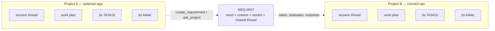
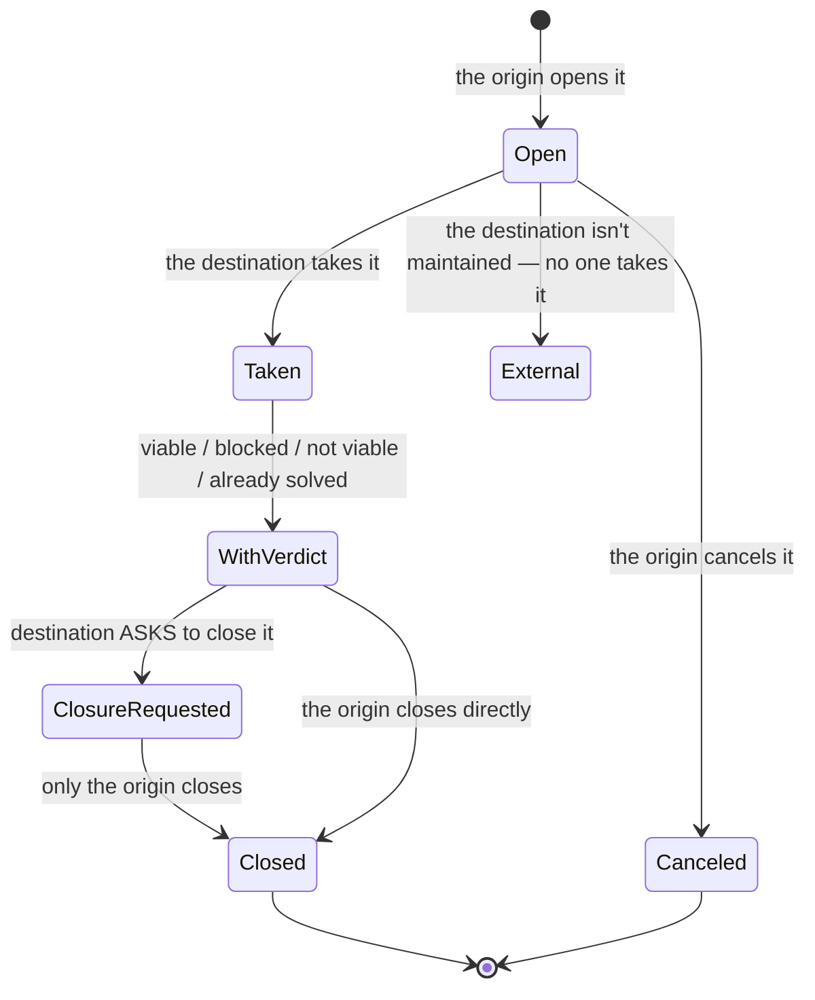
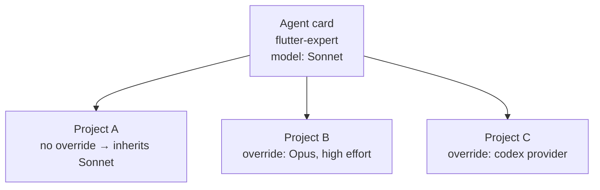
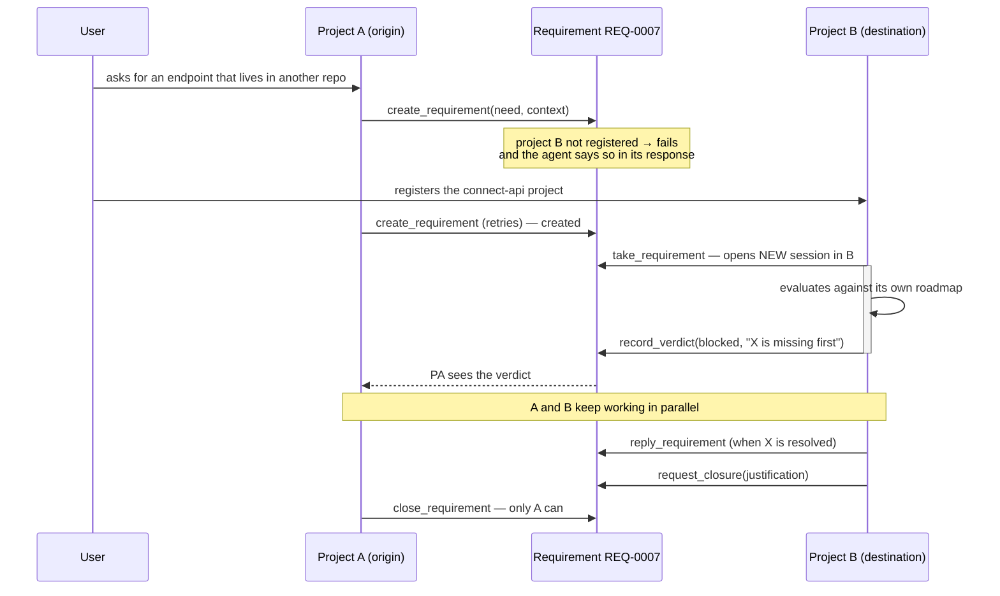

# 05 — Multiple projects

## The boundary between projects

Two projects share nothing by default: no conversation thread, no session plan, no work folder, no CLI session. Rules and knowledge bases reach only the members of the project they belong to, precisely **so one project doesn't know things about another** ([see F24](../features/24-proyectos-y-sesiones.md), [F26](../features/26-requerimientos-internos.md)). The easy way out — giving an agent access to two repos at once— breaks that boundary: an agent with two projects open starts reasoning about both, and decisions from one filter into the other without anyone asking.

The only things crossing the boundary are two explicit mechanisms: the **requirement** (ask for work) and `ask_project` (ask without asking for work).

Everything crossing goes through a single render function on Keel's side; if any context from the origin sneaked in there, the boundary would fall silently — it's the exact point to watch in any future change to that piece ([see F26](../features/26-requerimientos-internos.md)).

## Internal requirements: ask another project for work

A requirement is the only thing that crosses when one project needs something that lives in another repo. It carries **need, context, verdict, and shared thread** — nothing else from the origin.

**Closing is always the decision of who opened the requirement** — they're the only one who knows if what they needed is truly resolved. The destination can only *ask* to close, with justification. And this isn't a promise asked of the model by prompt: the origin project comes out of the URL with which Keel delivered the MCP server to that turn, so a destination turn **has no way** to say it's the origin — the restriction is mechanical ([see F26](../features/26-requerimientos-internos.md)).

The destination's verdict has four forms: **viable**, **blocked** (forces naming what goes first), **not viable**, or **already solved another way** — the case a traditional ticket can't tell: the work exists, but in a different shape than asked (for example, a different endpoint that covers the same need).

**Taking a requirement opens a new session** in the destination project, with the requirement block as the initial request and the instruction to evaluate it against its own roadmap before building anything. That it's a new session isn't style: it's the only way destination's work doesn't drag anything from who asked. It runs in parallel — the origin keeps going and finds out when there's a response ([see F26](../features/26-requerimientos-internos.md)).

A person can write directly in the requirement's thread — it's the only entry not written by an agent, and both sides see it: the "no, look, this is how it's done" when both projects are squinting at each other with half the reason.

### The gate

An agent can't open a requirement against a repo that isn't registered as a project in Keel — the tool fails with a clear message, and the agent says so in its response instead of making up a destination that doesn't exist. If the destination exists but is marked as **not maintained**, the requirement is still created, in state `external`: it's noted and visible, but no one takes it automatically ([see F26](../features/26-requerimientos-internos.md)).

## `ask_project`: ask without asking for work

Different from a requirement: `ask_project` asks another project something (how an endpoint looks, if something exists) without opening a formal request. It runs a separate agent in that repo, **read-only**, and returns only their answer — who asks never gets access to that folder. The difference between asking and moving in ([see F26](../features/26-requerimientos-internos.md)).

## Not-maintained projects (read-only)

A project can be marked `maintained: false`. In that state it is **read-only**, and that works only one way: removing the tools that write (Bash, Edit, Write) from its sessions — asking it by prompt would be asking, not guaranteeing. A tool that's not in the turn can't be used even if the model wants to. A project like this also doesn't take incoming requirements automatically: they stay noted as external ([see F24](../features/24-proyectos-y-sesiones.md)).

## Motor per project: different provider and model per project

An agent registers once with their identity (handle, role, instructions, skills). The **motor** — provider, model, effort — is something else: it's cost, and the same agent might need to think differently depending on the project. `flutter-expert` doing a small fix and `flutter-expert` redesigning a screen are the same identity thinking differently ([see F18](../features/18-motor-por-proyecto.md)).

A project can fix, per member, an override of provider/model/effort that wins over what the global agent card says. Without override, the member inherits what their card says — and if that card changes, all projects that didn't set an override inherit it too. This adjustment applies to the **complete member**, not one resolution node ([see F18](../features/18-motor-por-proyecto.md)).

Changing providers in the override changes what surface the turn has: a member moved to codex in that project loses deterministic tools, MCPs, and plan tools, same as a codex agent by birth — see [07 — MCPs, integrations, and providers](07-mcps-integrations-and-providers.md).

## Communication between projects at a glance

## Next step

For detail on how to set up agents that fill each project — skills, rules, hooks — continue with [06 — Agents, skills, rules, and hooks](06-agents-skills-rules-hooks.md).
