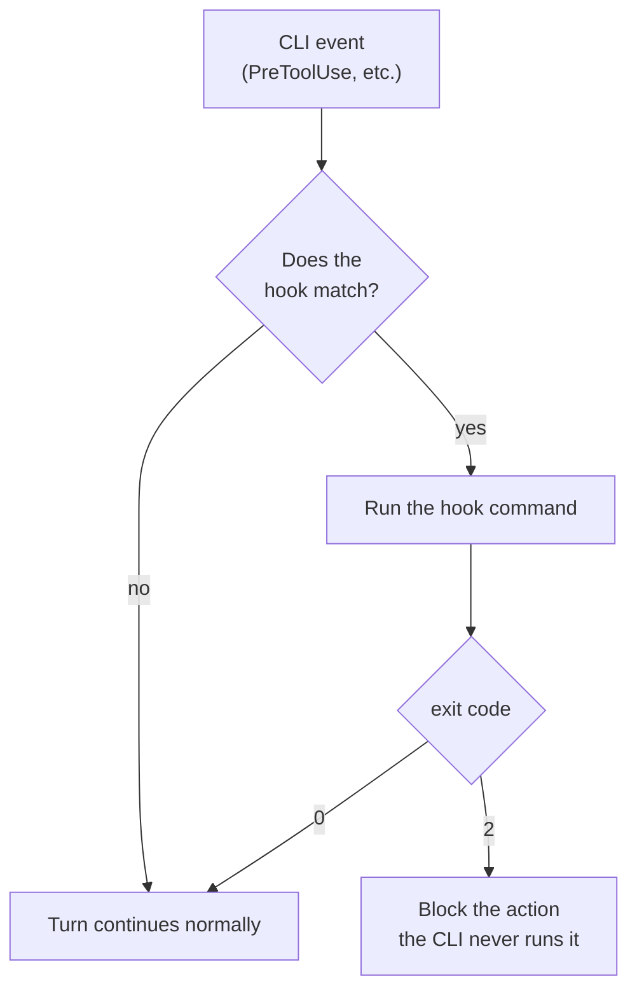
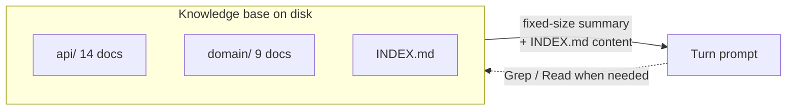

# 06 — Agents, skills, rules, and hooks

## Registered agents (profiles)

An `AgentProfile` is a reusable identity: unique handle across the app (`@nova-builder`), role (`implementer`, `auditor`, `planner`...), system prompt, model and effort by default, and provider (`claude` or `codex`). Registered once and reused in all projects where needed. The handle says **who they are**; the role says **what role they fill** in a workflow — they are different axes, and that's what lets the same role be filled by an agent of any stack depending on the project ([see root README](../../README.md), [F18](../features/18-engine-per-project.md)).

A profile can be marked as a **constructor** (`canManageSystem`): its 1:1 chats receive the same admin MCP as Keel AI (create skills, rules, tools, agents, workflows, projects), and the grant is verified live per turn, so revoking it applies from the next turn on. Useful to delegate system setup to a specialist who interviews the person ([see F2](../features/02-compiled-keelai-and-builders.md)).

## Skills: text injected into the prompt

A skill is name + content, and is injected as-is into the system prompt of whoever has it assigned. Can be:

- **global** — injected into **all** agents every turn, without needing to assign it to anyone: 1:1 chats and project members alike. The use criterion is norms or knowledge that apply to the whole system (style, business context) — not specialties of one specific role, which keep being skills explicitly assigned ([see F3](../features/03-global-skills.md));
- **assigned** — to a specific agent, or required by the active workflow and validated in preflight ([see F37](../features/37-adaptive-workflow-per-session.md)).

Every global skill travels complete in every turn of every agent — prompt cache cheapens it but it's not free, so keep them few and short ([see F3](../features/03-global-skills.md)).

The system also **detects repeated requests** without using any model (deterministic clustering on what the person writes) and suggests converting them to a global skill — a band on the Skills screen offers to create or dismiss the suggestion ([see F10](../features/10-recurring-skill-suggestions.md)).

## Rules: same form as a skill, different purpose

A rule has the same form as a skill (name + content) but is meant for norms of style or process, not knowledge. Can be an **agent** rule (applies only to it) or a **project** rule (applies to all its members).

## Hooks: the difference with a rule

This is the central distinction of the system between "ask" and "guarantee":

| | Rule | Hook |
|---|---|---|
| What it is | Prose in the system prompt | Command in a CLI event |
| Who decides | The model | The process, before the model |
| Can it be ignored? | Yes | No |
| Does it block? | No | Yes (`exit 2`) |
| When it fails | Silently | With message and error code |

*"Don't commit without running tests"* as a rule: the agent usually obeys, and when it doesn't, the person finds out later. As a hook: the commit **doesn't happen**. "Make it always happen" is a hook, never a rule ([see F22](../features/22-hooks.md)).

Both CLIs (claude and codex) have native hook support with the same form — event → matcher → commands —, and codex's events are an exact subset of claude's, so a hook is defined once and materializes depending on the turn's provider. They are assigned global, per-agent, or per-project, same as rules ([see F22](../features/22-hooks.md)).

A hook declares in `enforces` what rules it makes happen — the Rules screen shows which are **guaranteed** by a hook and which depend on the model obeying.

**Keel AI always stays outside hooks.** It's not a convenience exception: it's the emergency exit. A badly-written hook can lock up all the other agents, and the only way to fix it is turn it off — if what can turn it off were also subject to the hook, there'd be no way out ([see F22](../features/22-hooks.md)).



## Deterministic tools

Scripts (bash/python/dart) registered that an agent runs as a real MCP tool — for mechanical work that shouldn't depend on a model doing it "by hand" (parse an Excel, convert a format). Assigned per-agent. A hook can carry a tool as its command body; without it, the guardrail doesn't fire.

## Secrets: credentials never pass through the model

A secret is `{name, description, value}`, with the value always masked in the UI (no reveal button). It is injected as an environment variable **only** to deterministic processes — tool scripts and external MCP servers —, never to the agent's CLI: an agent with Bash access could do `echo $X` and the value would enter the model ([see F4](../features/04-secrets.md)).

An agent can **request** that a secret exist with `request_secret(name, why)` — registered without value, marked pending, and only the person can load it. A tool whose secrets are pending fails closed, with actionable message, instead of running without the variable ([see F4](../features/04-secrets.md)).

From the point this was implemented on, every turn's MCP configuration is written to a temporary file in a `0700` directory and the path is passed to the CLI, instead of inline JSON in process arguments — readable with `ps` from any other user on the machine ([see F4](../features/04-secrets.md)).

## Knowledge bases: the map, not the full territory

A knowledge base is documentation with its own name — a git repo or a local folder — that a project declares it sees. Each project sees only its own. An agent can have a base attached directly to its card (the "oracle" case: an agent whose job is to answer from a base, usable in 1:1 chat outside any project) ([see F16](../features/16-knowledge-bases.md)).

What reaches a turn **is not the base's content**, it's a fixed-size summary — doesn't matter if the base has 60 documents or 6,000:

```
Knowledge base "ATLAS" — API contracts, domain, and processes of the Atlas platform.
Root: /Users/…/knowledge/ATLAS  (63 documents)
  api/ (14) · domain/ (9) · processes/ (7) · release/ (3)
Search here with Grep/Read when you need a project fact.
```

If the base's root has an `INDEX.md`, its content is injected too (capped for size) — it's the cover that turns "knows where to look" into "knows what to look for". No special MCP tool needed to read: file tools are always allowed, so this works the same with claude and codex ([see F16](../features/16-knowledge-bases.md)).



## How an agent's turn is composed

All the pieces in this document —skills, rules, hooks, knowledge bases— combine into one single prompt plus one single set of tools each time an agent gets a turn. The complete diagram, layer by layer, is in [07 — MCPs, integrations and providers](07-mcps-integrations-and-providers.md#how-an-agents-turn-is-built).

Three rules hold for all of it, and are what sustain the system's security:

1. **Nothing is decided at runtime.** Skills are static text; if an agent needs to know something new, you add a skill to it.
2. **Scope comes from the URL, not an argument.** Local MCP servers carry the project and session inside the route they're delivered with — an agent can't name a project that isn't theirs because it has no way to.
3. **Credentials don't pass through the model**, as explained above.

## Next step

For detail on external MCPs, the integrations catalog, and multi-provider claude/codex, continue with [07 — MCPs, integrations, and providers](07-mcps-integrations-and-providers.md).
