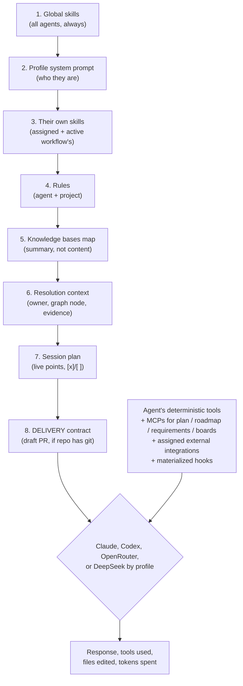

# 07 — MCPs, integrations, and providers

## MCP servers that the app itself runs

Keel runs six local MCP servers on `127.0.0.1`, with a token per start and a new instance per request:

| Server | What it gives the turn |
|---|---|
| `keelai-actions` | Create and fix system things (Keel AI and constructors only) |
| `keel-tools` | The user's registered deterministic scripts |
| `keel-plan` | Write and mark the session plan |
| `keel-roadmap` | Read the repo's roadmap and take tasks, atomically |
| `keel-requirements` | Ask something from another project, or ask questions |
| `keel-boards` | Build test boards |

Every turn runs with `--strict-mcp-config`: the CLI sees exactly what Keel delivered for that turn and nothing else — neither the global config of the user's machine nor the MCPs of another project ([see root README](../../README.md), [F28](../features/28-integrations-catalog.md)).

## External MCPs

An `McpServerConfig` (gmail, drive, github, linear, postgres...) registers once at the app level and is **assigned per agent** from their profile — the agent's card shows explicitly what integrations it carries. A server's tools reach the agent as `mcp__<name>__*` ([see F5](../features/05-external-mcps.md)).

Credentials always go by secret: a `secretEnv` field maps an environment variable to the **name** of a registered secret; the value resolves only when building that turn's config, in the same `0700` temp file explained in [06 — Agents, skills, rules, and hooks](06-agents-skills-rules-hooks.md). A remote server can also resolve a secret inside a header (`Authorization: {{TOKEN}}`) — if the secret's missing, the header is omitted entirely: a half-resolved header (`Bearer ` with nothing after) confuses more than an absent one ([see F28](../features/28-integrations-catalog.md)).

## The integrations catalog

Registering an MCP by hand — command, arguments, environment variables — means knowing in advance what goes in each field. The catalog solves the opposite case: fourteen known integrations with their exact config, category, what credential each asks for, and a link to official docs. Plus you can **paste** the `mcpServers` block that any third-party server publishes in its README, with preview before writing anything — the importer detects if that block brings a credential inside an `env`, even when the key name doesn't give it away (for example, `DATABASE_URL` with username and password inside the connection string) ([see F28](../features/28-integrations-catalog.md)).

An MCP marked with OAuth needs to auth outside Keel — the honest solution the catalog offers is an API token in the header, not a full OAuth flow, because `--strict-mcp-config` ignores the global config where an OAuth session already authenticated lives ([see F28](../features/28-integrations-catalog.md)).

## Test an integration live

Before this, a badly-configured MCP didn't alert: the person found out three turns later when an agent "didn't use the tool", unable to tell if it didn't want to or never had it. **Testing** does the same handshake as the real CLI (`initialize` → `notifications/initialized` → `tools/list`) and shows the list of tools an agent would actually see. The test result stays stored locally and **doesn't travel in any backup** — it's state of this machine right now, not config ([see F28](../features/28-integrations-catalog.md)). To see the real screen, open `../mockup/integraciones-tableros-y-maquina.html`.

## Multi-provider: Claude, Codex, OpenRouter, and DeepSeek

Each agent profile declares its provider and shows a two-letter badge.
Claude and Codex use their local CLIs. OpenRouter and DeepSeek use the
OpenAI-compatible API runner, including bounded tool-call rounds,
authorization checks, cancellation, evidence tracing, and DeepSeek reasoning
continuity. All four feed the same events and adaptive graph to the UI.

The API runner allows up to twelve tool rounds. Repeating
the exact same successful function with the same arguments and no intervening
context change is rejected once; if the provider insists again, the turn stops
early with the offending function named. A required MCP handshake or HTTP
error also fails explicitly instead of silently removing its functions from
the model's tool list.
When the runner already emitted a concrete cause, turn completion carries that
fact and the UI does not add a generic “provider reported an error” banner.
Internal safety stops identify Keel as their source; provider attribution is
reserved for failures that arrive without a more specific explanation.

Model catalogs are split by provider. Switching provider normalizes the model
to that provider's default and never falls back to Claude. OpenRouter loads
`GET /api/v1/models?supported_parameters=tools`; DeepSeek loads `GET /models`.
The picker caches the result, offers refresh, and accepts an exact manual model
ID.

`OPENROUTER_API_KEY` and `DEEPSEEK_API_KEY` live exclusively in Secrets. Their
fixed cards only show `configured` or `missing` and open the write-only secret
form; values are never displayed or prefilled. The workflow panel and engine
picker expose the same contextual shortcut. Preflight blocks an API node before
its turn when its key is absent. The main engine resolves only the selected
provider's value and passes it as transient turn data to the worker isolate;
the API runner never opens LocalDB and the key is never persisted or logged.

### Current codex limits

They are explicit design limits, not pending bugs:

- **No deterministic tools, no MCPs** (neither external nor `keelai-actions`) — those surfaces don't exist in the codex adapter today.
- **No configurable effort** — the selector stays visible in the UI but does nothing for a codex agent; its own config resolves it.
- **Cost per turn reports 0** — the codex JSONL doesn't emit it ([see F6](../features/06-codex-provider.md), [F7](../features/07-economical-communication.md)).

Because codex doesn't receive the session-plan MCP tools, a codex member writes and marks the plan with **fenced blocks** in their text (` ```plan ` / ` ```cumplido `) that the app parses when their turn closes — the same pattern a member who declares a new agent mid-conversation uses (` ```agente `). And because codex only receives the full system prompt on its session's first turn, resumed turns get the plan's live state prepended to the request, to not work against a frozen snapshot ([see F6](../features/06-codex-provider.md), [F17](../features/17-session-plan.md)).

An adaptive verification node closes only with recorded evidence. Provider choice does not create a separate fallback workflow: Codex and Claude use the same resolution graph, while provider-specific capabilities are made explicit in the prompt.

## Motor per project (recap)

A member's provider, model, and effort can be fixed **per project**, without touching the agent's global card — see the complete detail in [05 — Multiple projects](05-multiple-projects.md#motor-per-project-different-provider-and-model-per-project).

## How an agent's turn is composed

This is the complete diagram, layer by layer, of what Keel builds before launching the CLI binary:



If the profile is `codex`, the tools row shrinks: no MCPs and no deterministic tools, and plan and workflow rules travel as plain text (fenced blocks) instead of tools — everything else in the prompt builds the same.

## Next step

To take this config to another machine, or share it with another person, continue with [08 — Import, export, and packages](08-import-export-and-packages.md).
