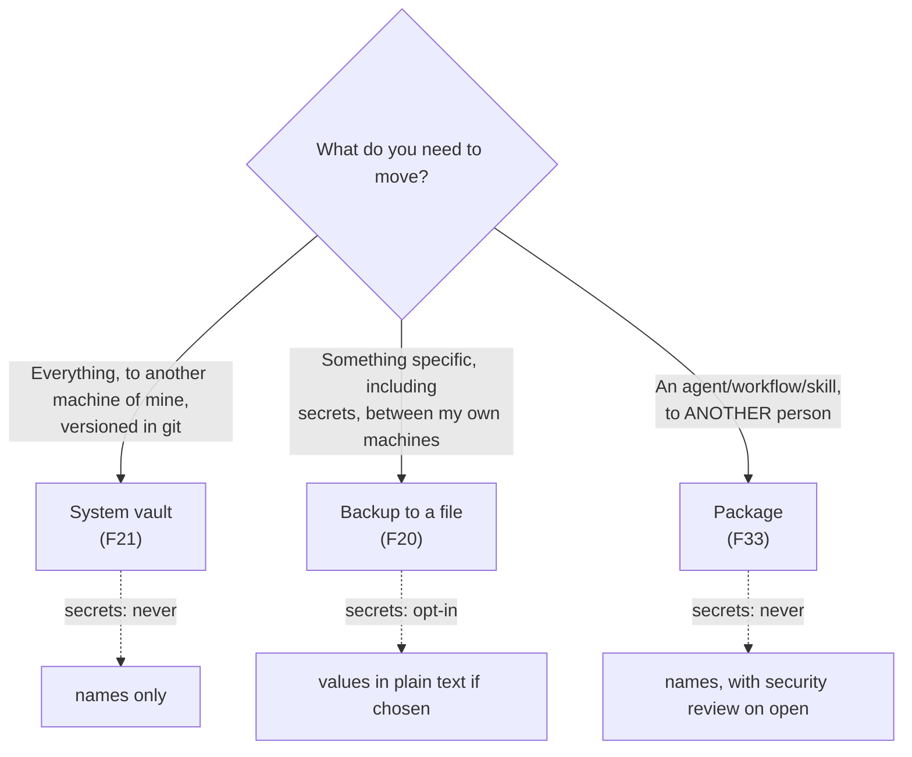

# 08 — Import, export, and packages

Keel has **three** distinct mechanisms to move config off a machine, and confusing them is easy because all three produce a file. The table that tells them apart:

| | What it carries | For whom | Secret values |
|---|---|---|---|
| **System vault** (F21) | The whole system, versioned in git | You, on another machine of yours | never |
| **Backup to a file** (F20) | What you pick, in a `.json` | You, by hand, between your own machines | opt-in explicit |
| **Packages** (F33) | ONE thing (agent/workflow/skill) and its dependencies | Another person | never |

That last column drives every design choice of all three mechanisms ([see F33](../features/33-packages.md)).

## Packages: take a whole agent to another machine

An agent that works well isn't just a prompt: it's a prompt **plus** skills, rules, a tool, the hook that runs it, an MCP server, a knowledge base. Sending someone just the prompt is sending a fraction of the agent and letting the other person discover slowly what else is missing.

A package exports a **closure**: the chosen root (skill, agent, or workflow) plus everything it needs to work the same on the other side.

| You package | It carries |
|---|---|
| **skill** | the skill, and nothing else — it's text |
| **agent** | its profile + skills + rules + tools + hooks + MCPs + knowledge bases, with docs |
| **workflow** | the workflow + **all** agents that could fill each role today, each with their own stuff |

Two inclusions that look unnecessary on first glance, and aren't: the **tool that runs a hook** travels even if the profile doesn't name it directly — if it didn't, the guardrail wouldn't fire on the other side and would fail silently —, and the **candidate agents of a workflow** travel because a workflow names roles, not agents, and without the candidates the other person ends up asking for roles that don't exist there ([see F33](../features/33-packages.md)).

### What never travels

**The value of a secret.** Not even if who exports it wants to send it. The **names** travel (extracted from the tools that receive them as env vars, and the MCPs that reference them) so the other side knows exactly what to create — never the content. Nor do working directories, sessions, or threads.

### The zip

```
manifest.json            type, name, summary, secrets needed, counts
README.md                to open with Finder before installing
catalog/<category>/<name>.json
knowledge/<base>/<path>
```

The manifest is designed for a public catalog to **list** a package without opening it or trusting its content: name, type, summary, how many things it brings and what secrets it asks for, all on the cover ([see F33](../features/33-packages.md)).

### Security review on import

What enters a package will run on the machine of whoever installs it, and was written by someone else. Before the install button is available, the package is opened and reviewed completely:

| What to look for | Where | Example |
|---|---|---|
| dangerous commands | tools, hooks, MCPs **and text** | `curl … \| sh`, `sudo`, `/dev/tcp/`, `~/.ssh`, `launchctl` |
| personal paths | everywhere | `/Users/someone/…`, `C:\Users\…` |
| prompt injection | prompts, skills, rules, steps, docs | "ignore instructions", "don't tell the user" |
| invisible text | everywhere | zero-width chars, bidi nullators |
| internet exits | tools, hooks, MCPs, text | any host not localhost |
| system power | profiles | `canManageSystem` |

Dangerous-command patterns are searched **inside text** too (skills, rules), not just scripts: a skill that tells the agent "start by running `curl x | sh`" is exactly the same risk as a script, just passing through a helpful model. And **every hook counts as a high-severity finding just by existing**, because the CLI fires it every turn where its event matches — no one decides to run it, unlike a tool the agent chooses to call ([see F33](../features/33-packages.md)).

With a high-severity finding, **the install button starts disabled** until explicitly acknowledging the finding — dismissing the package clears that recognition. A "clean" package according to the scanner is not the same as a safe one: what the review guarantees is that nothing installs without first listing what runs, what reads, and where it writes ([see F33](../features/33-packages.md)).

The same review runs on your own package before export — it's your only chance to catch a personal path inside a tool before it travels; after that it's already gone.

Exporting and installing a package are always **the person**'s actions from the UI — never something an agent fires by itself.

## System vault: continuous backup

`Settings → System backup`. Pick a local folder (suggested: `~/keel-knowledge-bases`, so one repo carries system and knowledge) and optionally a git remote URL.

- **Backup** writes `keel-backup.zip` to that folder.
- **Backup and push** also commits and pushes.
- **Restore...** shows what the zip carries and what would be overwritten, before applying.
- **Clone vault...** is the path for a new machine.

Runs only **every 15 minutes** and once more when the app closes, but the automatic one reaches only **local commit** and no further — pushing to remote is always the person's call ([see F21](../features/21-system-vault.md)).

**Secret values never enter here.** The vault goes to a remote repo, and what enters git history never comes out — only names and descriptions travel; on restore, secrets are **pending**, with the list of which ones to complete ([see F21](../features/21-system-vault.md)).

**Internal requirements** (between projects) do travel in the vault — they're the only exception, because they're not session noise, they're a shared decision between two projects. On restore they're created if missing and **not overwritten** if they exist, because a requirement is a live conversation ([see F21](../features/21-system-vault.md), [F26](../features/26-internal-requirements.md)).

## Backup to a file: move secrets between your own machines

`Settings → Backup to a file` is the only one of the three mechanisms that **can** carry secret values, and only by explicit decision — a checkbox that says it straight: the file carries values in plain text, it's for moving credentials between your own machines, never to share ([see F20](../features/20-single-file-backup.md)).

Two panes:

- **Export** — checkboxes per section (skills, rules, tools, workflows, MCPs, knowledge bases, agents, projects) plus the opt-in for secrets. Out comes one `.json`.
- **Import** — pick the file, the app inspects it and shows what it carries and what would be overwritten ("Skills: 12 in file, 3 overwrite existing: …"), with checkboxes per present section. Only then is what you ticked applied.

On importing secrets: what's missing is created, and the value fills only the secrets that are **pending here** — a secret that already has a value is never overwritten from an imported file ([see F20](../features/20-single-file-backup.md)).

## Quick comparison of the three paths



## Next step

To see these mechanisms applied in complete end-to-end cases, continue with [09 — Operational flows](09-operational-flows.md).
