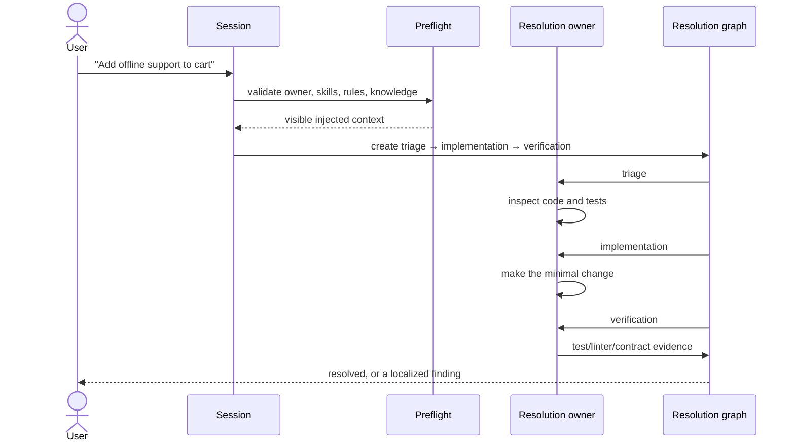
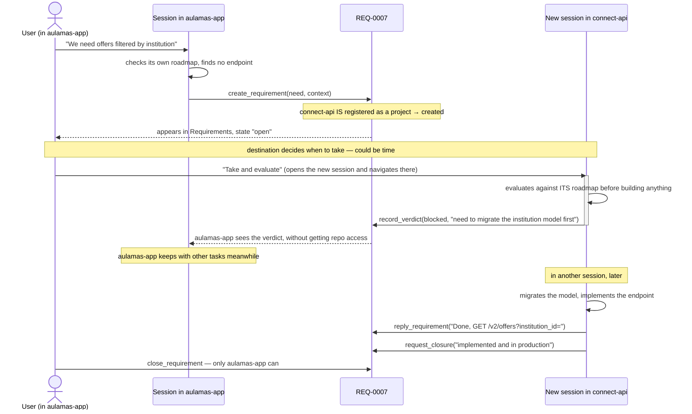
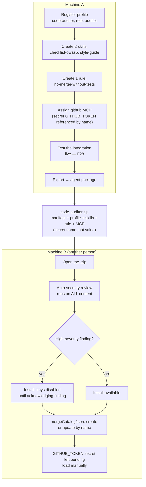

+# 09 — Operational flows

## a) A ticket resolves through an adaptive case

Scenario: a Flutter project opens a bug workflow with a resolver owner and
mandatory test gates.

If verification detects a type, linter, test, contract, or review failure, it
records a finding with a fingerprint. Only the affected node pauses and is
reformulated. An identical failure without a change is rejected; the case
blocks after its reformulation limit instead of replaying unrelated roles.

For a migration, the graph adds impact inventory and cannot close until model,
serialization, persistence, existing data, callers, compatibility, tests, and
UI are all addressed.

## b) One project asks another for something via an internal requirement

Scenario: `aulamas-app` needs an endpoint that lives in `connect-api`, a different project, managed by another team (or another role) in the same org.

Key points: both threads, both plans, both folders never mix — the only thing crossing is the requirement ([F26](../features/26-requerimientos-internos.md)); taking opens a **new session**, doesn't reuse origin context; and **closing is always who opened it**'s decision, verified mechanically by the MCP server URL delivered to that turn, not by a prompt instruction the model could disobey — see the complete detail in [05 — Multiple projects](05-multiple-projects.md#internal-requirements-ask-another-project-for-work).

## c) Build a new agent, assign skills and MCPs, export it, and use it on another machine

Scenario: build a `code-auditor` agent to review security and style, with two skills, one rule, and a GitHub MCP, and share it with another machine (or another team member).

Key points: an agent package includes **everything** it needs to work the same on the other side — skills, rule, MCP — but **never** the secret's value, only its name ([F33](../features/33-paquetes.md)); security review runs both on export (so who exports doesn't send a personal path by accident) and on import; and final install is the same "create or update by name" mechanism that vault and file backup use — one entry point to the catalog, not three different implementations ([F33](../features/33-paquetes.md)).

See the complete detail of each piece in [08 — Import, export, and packages](08-import-export-and-packages.md).

## Next step

To understand how all this differs from a single-agent code assistant in a terminal or IDE, continue with [10 — Differences from other tools](10-differences-from-other-tools.md).
