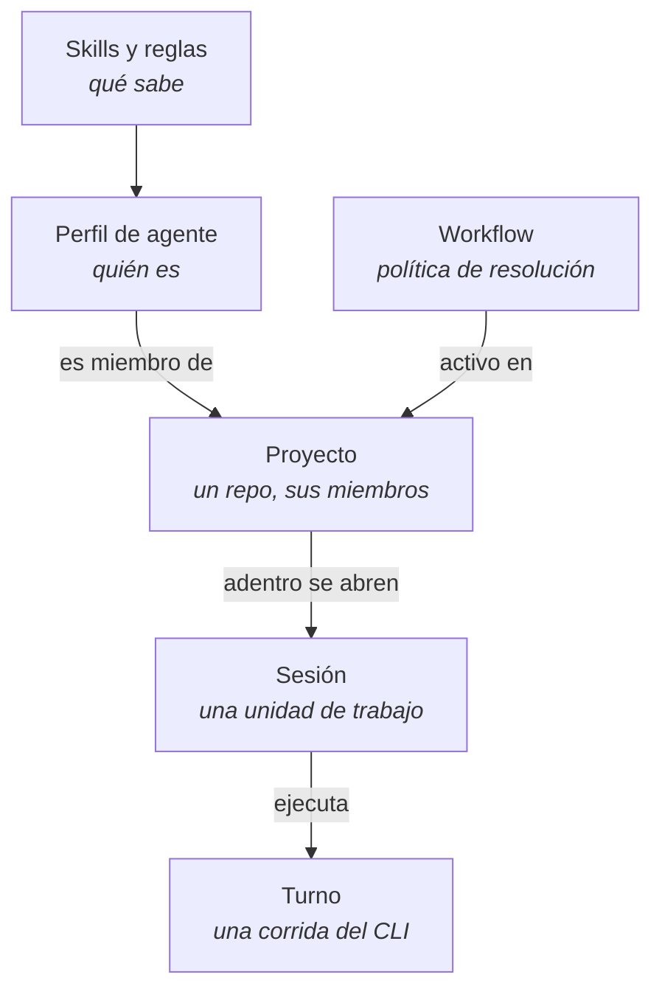

# 01 — Qué es Keel

## En una frase

Keel es una app de escritorio para macOS que envuelve el **CLI local** de Claude y de Codex — no habla con ninguna API propia, larga el mismo binario que correrías en una terminal, con el mismo login y la misma suscripción — y le agrega todo lo que hace falta para coordinar varios agentes, varios proyectos y un equipo grande sin que una persona tenga que llevar el contexto en la cabeza.

Lo que Keel agrega no es el modelo. Es **quiénes son tus agentes, qué sabe cada uno, en qué orden hablan, qué puede tocar cada uno, y qué queda escrito cuando terminaron**.

## Para quién es

Para alguien que:

- gestiona **más de un proyecto** de código a la vez (repos distintos, a veces stacks distintos);
- quiere delegarle trabajo a **varios agentes** con roles definidos, no hablar con un asistente genérico;
- necesita que el trabajo de un agente se pueda **repetir de forma consistente** (el mismo proceso de revisión en todos los proyectos);
- quiere que dos proyectos se puedan pedir cosas entre sí sin mezclar su contexto;
- necesita llevarse o compartir configuración completa (un agente, un workflow, una skill) como una unidad portable.

## Por qué existe

Con un agente en una terminal, el contexto lo lleva la persona: hay que volver a explicar el proyecto en cada sesión, acordarse de qué se le pidió al otro agente, y cuando algo sale mal, releer el scrollback.

Con varios agentes en varias terminales, eso deja de escalar. Keel apunta a que sí escale, con tres cambios de fondo:

- los agentes son **registros**, no ventanas de terminal — se configuran una vez y se reusan en todos los proyectos;
- el proyecto es **un contexto compartido**, no una explicación que hay que repetir cada vez que se abre una sesión nueva;
- las capacidades, el contexto, las dependencias y la política de evidencia son **un workflow** — una intención reusable desde la que Keel construye el grafo mínimo de cada caso.

## Filosofía de diseño

Cinco decisiones de diseño se repiten en toda la app y conviene tenerlas presentes antes de leer el resto de esta carpeta:

**Delegar, no repetir contexto.** Un proyecto guarda sus agentes miembros, sus reglas y sus bases de saber; abrir una sesión nueva no exige volver a explicar nada de eso.

**Nada se decide en runtime dentro del prompt.** Las skills son texto estático: si un agente necesita saber algo nuevo, se le agrega una skill, no se le pide que improvise.

**El alcance sale de la URL, no de lo que diga el modelo.** Los servidores MCP locales que Keel le entrega a un turno llevan el proyecto y la sesión adentro de la ruta. Un agente no puede nombrar un proyecto que no es el suyo porque no tiene cómo — la restricción es mecánica, no una instrucción que se le pueda pedir que ignore.

**Las credenciales no pasan por el modelo.** Los secrets se referencian por nombre en la configuración y se resuelven recién adentro de un archivo temporal `0700`, nunca en el prompt ni en los argumentos del proceso — que se leerían con `ps` ([ver F4](../features/04-secrets.md)).

**Roles, no personas.** Un workflow apunta a un **rol** (`implementador`, `revisor`, `auditor`), no a un handle puntual. Por eso el mismo workflow sirve en un proyecto Flutter y en uno de Rust: lo que cambia es quién ocupa el rol en cada proyecto, no el proceso.

## Las cinco piezas del modelo mental

- **Perfil de agente** — una identidad reusable: handle (`flutter-expert`), rol (`implementador`), system prompt, modelo y esfuerzo por defecto, y proveedor (Claude, Codex, OpenRouter o DeepSeek). Se registra una vez y sirve en todos los proyectos.
- **Skills y reglas** — texto que se inyecta tal cual en el prompt de quien las tenga asignadas. Las skills son conocimiento; las reglas, normas.
- **Proyecto** — un directorio de trabajo, sus agentes miembros, sus reglas propias y sus bases de saber. La granularidad es el repo.
- **Sesión** — una unidad de trabajo adentro de un proyecto, con su propio hilo. Dos sesiones del mismo proyecto no se ven entre sí.
- **Workflow** — política reutilizable de intención, capacidades, contexto, gates y delegación. Es de la **sesión**: el preflight crea para cada caso el grafo mínimo de nodos y evidencia, sin una secuencia fija de roles ([ver F37](../features/37-un-workflow-por-sesion.md)).

## Keel AI, el agente que administra el sistema

Hay un agente reservado, `keelai`, que vive en su propia ventana del sistema operativo y conoce cómo está armada la app — su mapa se re-sincroniza en cada arranque desde el código, así que nunca describe una versión de la app que ya no existe ([ver F1](../features/01-ventana-asistente.md), [F2](../features/02-keelai-compilado-y-constructores.md)).

No es un chat de ayuda: tiene tools reales. Pedirle "armame un proyecto para el repo de facturación con un implementador Flutter y un auditor" lo crea de verdad — el perfil, las skills, el workflow, el proyecto — mientras la ventana principal se actualiza en vivo. Y puede **leer** el estado del sistema, no solo crear: listar qué existe, ver el contenido completo de una skill o un agente, y corregir sin borrar y recrear ([ver F15](../features/15-keelai-ojos-abiertos.md)).

## Qué corre por debajo

Claude y Codex corren sobre sus CLIs reales. OpenRouter y DeepSeek usan sus APIs compatibles cuando sus secretos están configurados. Keel arma el contexto, entorno y herramientas autorizadas de cada turno; la base de datos de Keel sigue siendo local (LMDB).

## Siguiente paso

Para ver cómo se traduce esto en pantallas concretas, seguí con [02 — El front y la navegación](02-front-y-navegacion.md).
