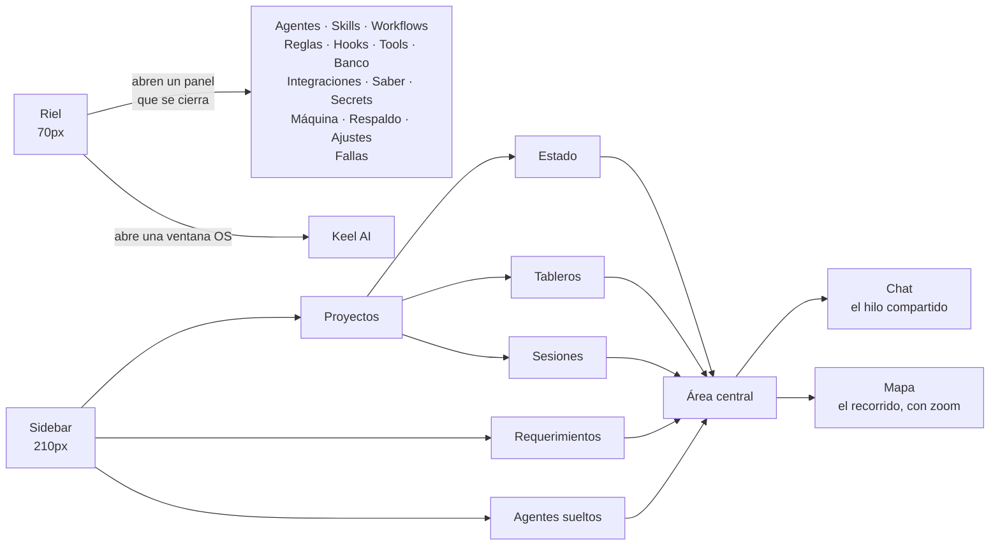
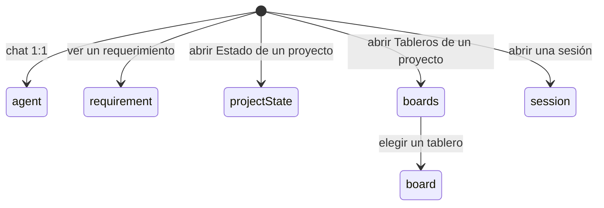

# 02 — El front y la navegación

## La forma general

La ventana principal tiene tres franjas: un **riel** angosto a la izquierda, un **sidebar** al lado, y el **área central** que ocupa el resto. Keel AI vive aparte, en su propia ventana del sistema operativo.

La regla que ordena todo: **el riel abre cosas que se cierran** — catálogos, formularios, configuración —, y el **sidebar elige qué conversación se ve**. Por eso los registros (skills, agentes, reglas...) nunca se tragan el área central: la conversación se queda atrás del panel que abriste desde el riel.

Todo formulario abre como un **panel deslizante a la derecha**; los diálogos modales quedan reservados para lo informativo y para confirmaciones sí/no.

## Un solo dato, un solo dueño: el lente

Qué se está mirando en el área central es **un único dato con un único dueño** (WorkspaceViewModel), no algo que cada pantalla deduce por su cuenta. Antes de esto, un tablero abierto y un clic en una sesión no hacían nada — el menú marcaba la sesión pero el centro seguía mostrando el tablero. Ahora seleccionar algo y navegar hacia algo son la misma operación ([ver F32](../features/32-una-sola-navegacion.md)):

Un proyecto abierto muestra siempre **tres secciones hermanas** en el sidebar — Estado, Tableros y Sesiones —, escritas con el mismo widget para que se lean como iguales ([ver F32](../features/32-una-sola-navegacion.md)). Para ver esto en una pantalla real, abrí `../mockup/proyectos-y-requerimientos.html`.

## Chat 1:1 vs proyecto

Hay dos formas de hablar con un agente:

- **Chat 1:1** — un agente registrado, fuera de cualquier proyecto. Sirve para consultas puntuales o para el caso "oráculo": un agente cuyo trabajo es contestar desde una base de saber ([ver F16](../features/16-bases-de-saber.md)).
- **Canal de proyecto** — el hilo de una sesión, donde se ve el trabajo coordinado del grafo del workflow activo.

Keel AI es un caso aparte: sus sesiones no aparecen en ninguna de las dos listas de agentes (ni el riel, ni "Agentes sueltos" del sidebar) — vive solo en su ventana flotante, para no mezclarse con los agentes que registró la persona ([ver F1](../features/01-ventana-asistente.md)).

Todo el contenido conversacional se interpreta como Markdown. Los bloques
largos permanecen compactos en el hilo y **Ver** elige la representación por
contenido: `markdown`, `text` y `plaintext` se renderizan como documentos; las
declaraciones de Keel (`workflow`, `proyecto`, `agente`, `skill`, `regla`,
`plan`, `cumplido` y `cobertura`) se convierten en fichas Markdown con campos,
listas y capacidades; el código fuente conserva un visor monoespaciado con
resaltado según su lenguaje. Los alias como `js`, `ts`, `py`, `sh` o `yml` se
normalizan antes de resaltarlos. El visor conserva exactamente la fuente del
bloque y ajusta las líneas largas al ancho del panel, para que el contenido no
desaparezca detrás de un scroll horizontal invisible.

## Chat vs Mapa

Una sesión de proyecto se mira de dos formas, con la misma información de fondo pero distinto ángulo:

- **Chat** es el hilo: quién dijo qué, en orden.
- **Mapa** es el mismo trabajo como grafo de dependencias: muestra los nodos, dueño actual, evidencia, hallazgos y subagentes debajo de su nodo padre. Así deja ver qué está bloqueado, qué puede ejecutarse y qué se está razonando ahora ([ver F31](../features/31-mapa-de-razonamiento.md), detalle completo en [04 — Delegación y equipos](04-delegacion-y-equipos.md)).

Para ver el dibujo real de esta pantalla, abrí `../mockup/mapa-de-razonamiento.html`.

## Escribir mientras el agente trabaja

El composer no se bloquea durante un turno. Escribir y enviar mientras el agente está respondiendo **encola** el mensaje — los dos CLIs son de un solo tiro por turno, así que no hay forma de inyectarlo a mitad de turno — y al terminar, todo lo encolado sale como un único turno siguiente, con las imágenes que se le hayan adjuntado ([ver F14](../features/14-cola-de-mensajes.md)).

Si el turno se frenó con **Detener**, la cola no se dispara sola: parar es "tomo el control", y la tira ofrece "Enviar ahora" en vez de arrancar un turno nuevo automáticamente. Esta cola aplica al chat 1:1 y a la ventana de Keel AI; los proyectos todavía no tienen cola propia ([ver F14](../features/14-cola-de-mensajes.md)).

## Imágenes en el chat

Se sueltan directamente sobre el área de conversación (o con el botón del composer). Cada adjunto se ve como una tarjeta de preview acotada (200×140), nunca a tamaño completo, y se abre en grande al hacer clic. La imagen se copia al almacenamiento de la app antes de mostrarse — así sobrevive aunque el archivo original se mueva o se borre — y llega al modelo **por ruta**, no por bytes: el agente la lee con su propia tool `Read` cuando decide que hace falta mirarla ([ver F13](../features/13-imagenes-en-el-chat.md)).

Esto funciona en el chat 1:1 (y en la ventana de Keel AI, que comparte el mismo widget); los proyectos todavía no aceptan adjuntos.

## Enlaces clickeables y el PR de la sesión

Las URLs que un agente deja peladas en su respuesta (por ejemplo, la salida de `gh pr create`) se vuelven clickeables automáticamente, salvo dentro de bloques de código y salvo que no sean `http(s)`. Si algún mensaje de la sesión nombra un pull request de GitHub, el encabezado de la sesión muestra su número (`PR #N`) con un clic directo — leído de los mensajes, no de un campo aparte, porque un campo aparte sería un segundo lugar donde ese dato podría quedar viejo ([ver F19](../features/19-enlaces-y-pr.md)).

## Multi-ventana

Keel AI corre en **otro engine de Flutter**, separado de la ventana principal: es un cliente de presentación — no tiene su propio `AgentsViewModel`, no abre la base local, no arranca servidores MCP — que renderiza lo que la ventana principal le empuja y devuelve intenciones por un canal nativo. Esto es lo que le permite mutar la app principal en vivo mientras se conversa con él, sin duplicar estado pesado ([ver F0](../features/00-fundacion-multi-ventana.md), [F1](../features/01-ventana-asistente.md)).

## Worktrees de git

Si el directorio de trabajo de un proyecto es un **worktree aparte** (otra carpeta del mismo repo, en otra rama, para trabajar dos cosas a la vez), la app lo detecta sola — sin ninguna casilla que marcar — y lo dice en una franja arriba de lo que estés mirando: en qué rama estás y cuál es el worktree principal. Ahí mismo está **Unificar**, que trae la rama base al principal, mueve la rama de trabajo y saca la carpeta de al lado, con una lista de lo que se borra con ella antes de tocar nada ([ver F34](../features/34-worktrees.md), más detalle en [03 — Proyectos, sesiones y workflows](03-proyectos-sesiones-y-workflows.md)).

## El diario de fallas

Un registro en el riel, con el número de fallas no vistas, agrupa **todo** lo que se rompe en la app — un respaldo que no pudo escribir, un flujo que se cortó, un error de interfaz — en un solo lugar con su stack y de qué archivo salió. Antes eso solo vivía en la consola, que existe únicamente si la app se abrió desde una terminal. Si la ventana no está enfocada, además avisa con una notificación de macOS. Nada de esto sale de la máquina ([ver F35](../features/35-diario-de-fallas.md)).

## Siguiente paso

Para el detalle de cómo se organiza el trabajo dentro de un proyecto, seguí con [03 — Proyectos, sesiones y workflows](03-proyectos-sesiones-y-workflows.md).
