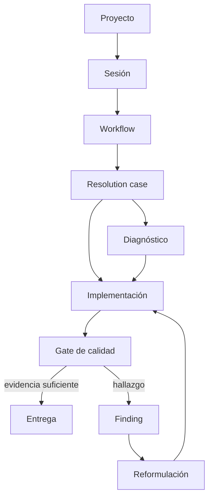

# 03 — Proyectos, sesiones y workflows

Un **proyecto** conecta un directorio de trabajo con sus agentes, reglas, skills, conocimiento y workflows. Una **sesión** es un caso aislado dentro del proyecto. Cada sesión selecciona un workflow, pero su ejecución se guarda como un grafo adaptativo: el workflow define la política y el caso define el trabajo real que se debe resolver.

## Workflow: una política reutilizable

Un workflow describe la intención, capacidades, contexto obligatorio, gates de calidad, límites de reformulación y política de delegación. Cada capacidad tiene ID estable, título, instrucción, rol por defecto, dependencias y modo `required` u `optional`. No contiene una lista ordenada, índices ni una cadena que deba reiniciarse.

El preflight resuelve antes de iniciar qué agente concreto ejecutará cada capacidad requerida, qué skills, reglas y fuentes de conocimiento se inyectarán, qué credencial exige su proveedor y qué falta. Esa decisión se persiste en cada nodo y aparece en el panel derecho. Si falta un requisito, el caso queda bloqueado con su motivo; no se gasta un turno intentando adivinarlo.

El workflow guarda el rol por defecto. El proyecto puede guardar un override concreto por workflow y capacidad. Un click normal sobre el agente cambia solo ese proyecto; la acción secundaria modifica explícitamente el default compartido. Un nodo corriendo o terminado no admite cambios de dueño.

Una capacidad opcional aparece como `disponible` y puede activarse directamente desde el riel. La activación agrega un nodo al caso existente con su agente concreto; no vuelve a ejecutar trabajo validado. El contexto inyectado y todos los faltantes del preflight quedan persistidos para que panel, mapa y motor lean la misma decisión.

## Caso de resolución

Al empezar una sesión, Keel crea un `ResolutionCase` con nodos de trabajo, dependencias, evidencia y hallazgos. Un nodo tiene un responsable, un estado y una salida verificable. Los nodos listos pueden ejecutarse; los ya validados no se repiten y el caso nunca vuelve globalmente al inicio por un pendiente.

Un hallazgo de compilador, linter, test, contrato o revisión pausa solo el nodo afectado. El responsable recibe la evidencia, ajusta el plan y abre o corrige el nodo necesario. La misma huella no puede reintentarse sin cambiar código, contexto o plan. Después de dos reformulaciones sin avance, el caso se bloquea con alternativas concretas para una decisión humana.

## Migraciones

Las migraciones usan una matriz obligatoria: modelo, serialización/API, persistencia, datos existentes, lectores/escritores, callers, compatibilidad, pruebas y UI cuando aplique. Una fila pendiente impide cerrar el caso; una fila marcada como no aplicable conserva su justificación. El integrador es dueño del resultado de extremo a extremo, no solo de un archivo.

## Estado, mapa y entrega

La vista de sesión presenta el grafo persistido: dependencias, dueño actual, evidencia, gates, bloqueos y hallazgos. El mapa no usa columnas por índice; ubica los nodos por sus dependencias y mantiene los subagentes debajo de su nodo padre. El panel derecho conserva el riel visual de 272 px del producto: filas con `listo`, `ahora`, `pendiente`, `bloqueado`, `disponible` o `no requerido`, agente, proveedor/modelo/esfuerzo, consultas y findings. Debajo muestra skills, reglas y conocimiento editables sin sustituirlos por una lista informativa.

En un repositorio Git, la entrega conserva el contrato de PR draft. La verificación se apoya primero en evidencia real —análisis, pruebas focalizadas, compatibilidad y regresión proporcional— y solo después permite cerrar.

Cuando un workflow guardado necesita el esquema nuevo, Keel crea primero un respaldo crudo fechado fuera del catálogo activo y después reescribe ese mismo workflow. Conserva nombre, instrucciones y roles como capacidades; diagnóstico, implementación y cierre quedan requeridos por defecto y las revisiones especializadas quedan opcionales. El respaldo nunca se ejecuta.

## Eliminación de workflows

Eliminar un workflow es una operación de dominio en cascada. Junto con la
entrada del catálogo se eliminan todas sus asignaciones a proyectos, el default
activo, los overrides por capacidad y las referencias de sesión. La sesión
conserva mensajes, evidencia y su `ResolutionCase` materializado; solo se
limpia el ID de catálogo que ya no puede resolverse. Si queda otro workflow
asignado, pasa a ser el default del proyecto. Al cargar proyectos, Keel también
repara y persiste referencias rotas escritas por versiones anteriores.

## Siguiente paso

Leé [04 — Delegación y equipos](04-delegacion-y-equipos.md) para ver cómo se asignan responsabilidades y subagentes dentro de un caso.
