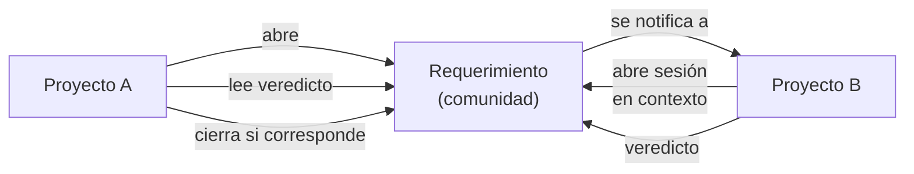
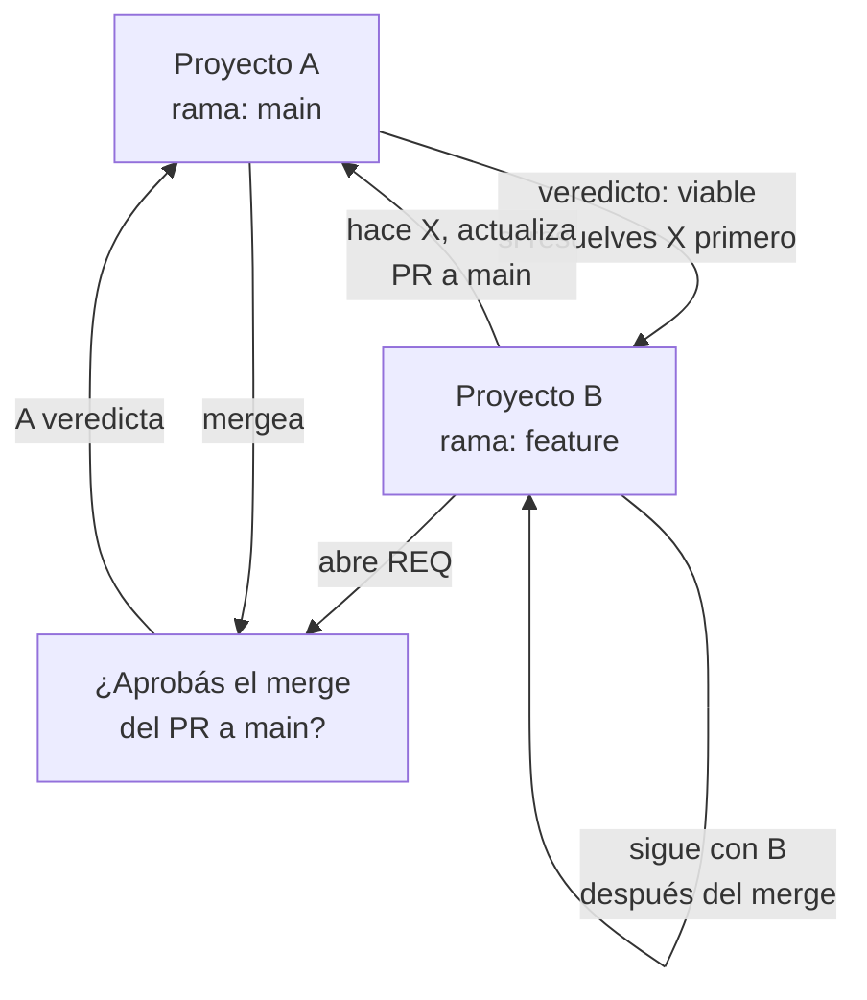

# 05 — Múltiples proyectos

## Frontera entre proyectos

Un proyecto es una **unidad aislada**: su carpeta de trabajo, sus agentes miembros, sus reglas, sus bases de saber. Dos proyectos no comparten nada — ni el contexto, ni el plan, ni lo que está en TASKS/, ni lo que se escribió en sus hilos anteriores.

Eso aislamiento es lo que lo hace seguro trabajar en varias cosas a la vez sin que una se cuele en otra. La contrapartida es que si el **proyecto A necesita del proyecto B** (una decisión de B, información que vive ahí, trabajo que solo B puede hacer), A tiene que comunicarlo explícitamente.

## Requerimientos internos: el puente entre proyectos

Cuando un proyecto necesita algo de otro, abre un **requerimiento interno** (`REQ-0007`). Lo único que cruza la frontera es eso:

- **Necesidad**: qué pide (en texto libre).
- **Contexto**: suficiente para que B lo resuelva sin leer todo lo de A.
- **Veredicto de B**: viable / bloqueado (nombrando qué va primero) / no viable / ya-resuelto.
- **Hilo**: conversación entre los dos proyectos, con lecturas en ambos lados.

A abre el requerimiento y **es el único que puede cerrarlo** — porque es el único que sabe si lo que necesitaba se cumplió con el veredicto que B dio. B responde, pero no cierra. El usuario puede escribir en el medio desde ambos lados y eso lo ven los dos.

Un requerimiento abierto desde una sesión de A genera una sesión NUEVA en B (con su propio hilo, su propio plan, su propio workflow): la tarea de B está encapsulada. Una vez tomado, el panel de requerimiento ofrece "Ir a la sesión" para alternar entre el trabajo de A que lo abrió y el de B que lo resuelve.

Lo que **no viaja** con un requerimiento: el plan de A, la carpeta TASKS/ de A, el hilo anterior de A, ni los archivos adjuntos. Viajer solo lo escrito en ese requerimiento — su necesidad inicial y la conversación que sigue — junto con una referencia a la sesión que lo originó. B ve el requerimiento sin ver nada de lo demás de A.

## ask_project: preguntar sin pedir

Existe también la variante de **solo preguntar**: `ask_project` dirige una pregunta a otro proyecto sin pedirle trabajo. Se ejecuta un agente en ese proyecto en lectura, devuelve la respuesta, y eso es todo — el que pregunta no recibe acceso ni a la carpeta ni a nada más. Sirve para buscar hechos: "¿cuál es la API de autenticación?", "¿qué secretos pide la integración con X?", sin tener que abrir una sesión en ese proyecto.

## Proyectos no mantenidos por el usuario

Un proyecto se puede marcar como `maintained: false`: se vuelve de **solo lectura**. Sus sesiones no reciben las herramientas que escriben (Bash, Edit, Write…), así que no pueden tocar el repo aunque se lo pidan. Sirve para proyectos que existen para consultar (una base de código heredada, un core que otro equipo mantiene) pero que un agente de tu equipo no debería estar modificando.

## Motor por proyecto

El **provider**, el **modelo** y el **esfuerzo** de un miembro se pueden fijar **solo para un proyecto específico**, sin tocar su ficha global. Eso permite que `@flutter-expert` corra en Sonnet en el proyecto A y en Opus en el proyecto B, según lo que cada uno necesite sin perder su identidad de perfil ([ver F13](../features/13-motor-por-proyecto.md)).

## Flujo de sincronización: el caso de dos ramas en paralelo

Cuando dos proyectos comparten un repo pero en ramas distintas (uno en `main`, otro en una rama de feature), el flujo de requerimiento refleja cuál decisión bloquea a cuál:

Lo que esto permite es que B y A trabajen en paralelo sabiendo exactamente en qué punto A necesita que B haya terminado.

## Siguiente paso

Para entender qué controla la identidad de un agente y qué se le puede asignar, seguí con [06 — Agentes, skills, reglas y hooks](06-agentes-skills-reglas-hooks.md).
