# 06 — Agentes, skills, reglas y hooks

## Perfil de agente

Cuando registrás un agente, Keel almacena una **ficha reusable** — se puede asignar a cualquier proyecto, sin importar cuántos. La ficha contiene:

- **handle** — identificador único en minúsculas, máximo 16 caracteres. Ej: `flutter-expert`, `code-auditor`.
- **rol** — el puesto que ocupa en un workflow. Ej: `implementador`, `revisor`, `auditor`.
- **system prompt** — instrucciones del agente.
- **modelo y esfuerzo por defecto** — modelo a usar si no los fija el proyecto; se pueden override por proyecto ([ver F13](../features/13-motor-por-proyecto.md)).
- **provider** — `claude`, `codex`, `openrouter` o `deepseek`.
- **skills asignadas** — lista de skills (conocimiento) que se inyectan en su prompt.
- **reglas asignadas** — lista de reglas (normas de conducta).

Dos agentes pueden compartir el mismo rol. El preflight de un workflow selecciona un responsable que cubra las capacidades requeridas y deja registrada esa decisión; si falta el rol o el contexto obligatorio, bloquea el caso antes del primer turno.

## Skills: conocimiento estático

Una **skill** es un bloque de texto que entra completo y sin cambios en el prompt de quien la tenga asignada.

```mermaid
flowchart LR
    SKILL["Skill<br/>&#39;Flutter patterns&#39;<br/><br/>Contenido:<br/> - widgets como clases<br/> - modelos tipados<br/> - etc"]
    
    A["Agente A<br/>skills: [Flutter patterns]"]
    B["Agente B<br/>skills: [Flutter patterns]"]
    C["Agente C<br/>skills: []"]
    
    SKILL -.asignada a.-> A
    SKILL -.asignada a.-> B
    SKILL -.no la tiene.-> C
```

Una skill se puede asignar **globalmente** — todos los agentes la reciben automáticamente en cada turno, sin declararla — o **por agente**. La forma de saber si un cambio a tu equipo vale registrar como skill es si lo dirías en **todas las sesiones de ese agente**, repetido igual. Si lo dices una sola vez en una sesión, va en el plan o en el hilo, no en una skill.

## Reglas: normas de conducta

Una **regla** es un bloque de texto que también entra en el prompt, pero pensado para normas: estándares de código, forbiddens, protocolos de paso de trabajo. **Una regla se asigna IGUAL que una skill**, pero la separación conceptual ayuda a la lectura: skillshabla de lo que sabés, reglas hablan de lo que debés.

## Hooks: la forma de GARANTIZAR algo

Los **hooks** son **deterministas y no negociables** — son lo único que ejecuta el CLI sin que un modelo lo decida, así que es lo que garantiza reglas imposibles de violar ([ver F22](../features/22-hooks.md)).

Un hook engancha en un **evento** del turno (antes de abrir la sesión, después de que un agente termina, antes de armar el prompt, etc.) y ejecuta un **comando** — un script bash determinista que vos escribiste, o una tool registrada. Si el comando devuelve código de salida 2, el evento se frena ahí — lo que iba a pasar no pasa.

**La diferencia es literal**: Una regla puede ser ignorada (un agente intenta violarla y la salida es que hace algo prohibido). Un hook no puede ser ignorado (el código devuelve 2, Keel no continúa, punto).

Si el proyecto tiene un hook que detecta "no se puede escribir un archivo sin test" y devuelve 2, ese archivo no se escribe, independientemente de lo que diga el prompt del agente.

Cada hook declara en `enforces:` qué regla del proyecto garantiza — así queda claro para quién lee el proyecto qué está siendo forzado por código.

## Tools determinísticas

La **forma de que algo sea determinista** es sacarlo de la CLI al momento de ejecución: `create_tool` registra un script (bash, python o dart) que un agente puede llamar como si fuera una tool MCP real. Se asigna por agente — solo los que la tienen asignada la ven.

Ejemplo: en vez de que un agente "parsee un CSV a JSON" en cada turno, registrás una tool `csv-to-json` que hace eso en 50 milisegundos y la asignás a los agentes que la necesitan.

## Secretos: referencias, no valores

Un **secreto** es un nombre — `API_KEY_X`, `GITHUB_TOKEN` — que el usuario carga el **valor** desde la UI, con un botón de "Cargar valor". El valor nunca pasa por el modelo, nunca entra en el prompt, nunca es visible en un log — se resuelve en el último milisegundo dentro de un archivo `0700` temporal que se borra después ([ver F4](../features/04-secrets.md)).

Una tool o un servidor MCP que necesita un secreto lo pide por nombre en su configuración (ej: `auth_header: "Bearer {{API_KEY_X}}"`), no por valor. A runtime, `{{API_KEY_X}}` se reemplaza en un proceso aparte, aislado del modelo.

## Bases de saber

Una **base de saber** es un cuerpo de documentación — un folder del usuario o un repositorio git — que Keel indexa y inyecta en el turno de un agente en forma de **mapa**: la raíz de la base, cuántos documentos tiene, qué carpetas hay a nivel 1, y el contenido del `INDEX.md` de la raíz si existe.

La base llega solo a los miembros del proyecto que la declara. La inyección es el mapa, no todo el contenido — el agente abre documentos individuales con Read/Grep cuando los necesita ([ver F19](../features/19-bases-de-saber.md)).

## Composición del turno de un agente

Cuando un agente entra en un turno, su prompt se arma capa por capa (en este orden):

1. **Skills globales** — las que marcaste global.
2. **System prompt del perfil** — sus instrucciones.
3. **Skills propias** — las que asignaste específicamente a ese agente.
4. **Reglas** — sus reglas propias + las del proyecto.
5. **Mapa de bases de saber** — índices de documentación.
6. **Identidad y compañeros** — quién es, a qué rol corresponde en el proyecto, quiénes son sus pares.
7. **Regla de consulta** — cómo pueden mencionar a otros y cuál es el tope de costo.
8. **Pregunta vs pedido** — si es un ping directo o un trabajo delegado, y de quién.
9. **Plan de la sesión** — los puntos verificables que se acordaron.
10. **Entrega** — lo que la sesión espera de él (un PR abierto, un reporte, etc.).
11. **Regla del canal** — qué convención de formato de cada paso (ej: "close-on-done").

Si el agente está en un **worktree** aparte en lugar de la rama principal, se suma una sección WORKTREE que le dice "la rama ya existe, no abras otra".

## Siguiente paso

Para ver cómo múltiples proveedores coexisten en la misma app y cómo se asignan los MCPs, seguí con [07 — MCPs, integraciones y proveedores](07-mcps-integraciones-y-proveedores.md).
