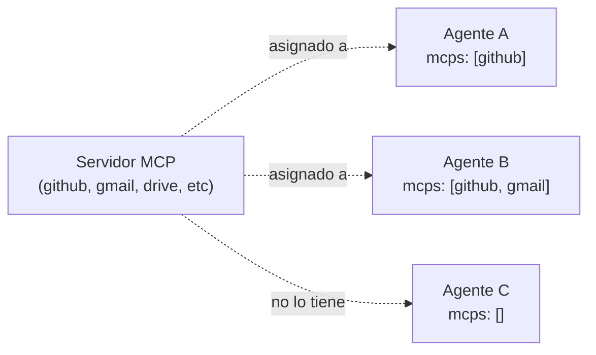

# 07 — MCPs, integraciones y proveedores

## Servidores MCP: tools locales y remotas

Un **servidor MCP** (Model Context Protocol) es una fuente de tools — comandos que un agente puede llamar durante su turno. Keel conoce dos tipos:

- **Locales** — el CLI local (`claude` o `codex`) proporciona; Keel se los pasa en cada turno.
- **Externos** — integraciones (GitHub, Gmail, Drive) registradas con credenciales de verdad; se convocan al iniciar la sesión.

Un agente solo ve los MCPs que tiene asignados. No es una herencia: si un proyecto tiene 5 MCPs registrados, cada agente ve solo los suyos.

## Catálogo de integraciones conocidas

Existe un **catálogo global** de integraciones que Keel sabe armar (`github`, `gmail`, `drive`, `linear`, `slack`, etc.) — cada una con la configuración exacta de tools y headers que necesita, sacada de la documentación oficial. El catálogo aparece en la UI y se puede instalar directo desde ahí sin escribir JSON a mano.

Si necesitás una integración que no está en el catálogo, Keel permite **registrar a mano** pegando el bloque `mcpServers` desde la documentación de ese servidor — pero siempre se prefiere el catálogo porque ya está validado ([ver F25](../features/25-mcps-integraciones.md)).

## Probar una integración

Antes de activarla en un agente, existe un botón "Probar conexión" en cada integración registrada: se conecta de verdad al servidor, lista las tools que devuelve, y si algo está mal se ve al toque (credencial incorrecta, servidor caído, configuración incompleta). No hay "asumamos que funciona" — probás, ves, y después la asignás.

## Credenciales: por secret, nunca en texto

Una integración que necesita credencial la pide a través de un **secret** — nombre-solo, el usuario carga el valor. Por ejemplo, `github-token` es el nombre, y el token real se carga con un botón "Cargar valor" en la pantalla de Secrets ([ver F4](../features/04-secrets.md)).

En la configuración del servidor se escribe así: `authorization: "token {{github-token}}"`. A runtime, `{{github-token}}` se resuelve justo antes de crear el cliente MCP, adentro de un proceso aislado, sin pasar nunca por el modelo.

## Múltiples proveedores: Claude, Codex, OpenRouter y DeepSeek

Un proyecto puede combinar agentes de los cuatro proveedores. Claude y Codex
usan sus CLI locales. OpenRouter y DeepSeek usan el runner de API compatible
con OpenAI y pueden solicitar tools controladas por Keel; permisos, carpeta,
solo lectura, hooks, cancelación y evidencia siguen aplicando en cada ronda.

El runner permite hasta doce rondas de tools. Si el proveedor repite la
misma función exitosa con los mismos argumentos sin ningún cambio de contexto,
Keel la rechaza una vez; si insiste, corta temprano y nombra la función que
quedó en bucle. Si un MCP requerido falla durante el handshake o responde con
un error HTTP, el turno falla explícitamente en vez de esconder esas tools.
Cuando el runner ya mostró una causa concreta, la finalización conserva ese
dato y la UI no agrega el banner genérico “el proveedor reportó un error”. Los
cortes internos de seguridad nombran a Keel como origen; el fallback del
proveedor queda reservado para fallos sin una explicación más específica.

Cada proveedor tiene su catálogo. Cambiarlo normaliza el modelo al default del
nuevo proveedor y nunca lo devuelve a Claude. OpenRouter consulta solo modelos
que anuncian soporte de tools; DeepSeek consulta su endpoint `/models`. El
selector conserva caché, refresco manual e ID exacto para modelos que todavía
no aparecen.

`OPENROUTER_API_KEY` y `DEEPSEEK_API_KEY` viven exclusivamente en Secrets. Las
tarjetas fijas muestran `configurada` o `faltante` y abren el formulario de
escritura; nunca enseñan ni precargan el valor. El panel del workflow y el
selector de motor ofrecen el mismo acceso. Si falta la clave de un nodo API,
el preflight bloquea antes de gastar un turno. El engine principal resuelve
solo el valor del proveedor elegido y lo entrega como dato transitorio al
isolate del turno; el runner API nunca abre LocalDB y la clave no se persiste
ni aparece en logs.

## Composición completa del turno: capa de MCPs

Cuando un agente arranca, el turno se arma con:

1. System prompt, skills, reglas, bases de saber (ver [06](06-agentes-skills-reglas-hooks.md)).
2. **MCPs asignados** — la lista de tools que puede llamar.
3. **Contexto de proyecto y sesión** — carpeta, rama, cambios, historia.
4. **La pregunta** — lo que tiene que hacer.

Si el agente llama un MCP, Keel:

1. Identifica el servidor del MCP.
2. Conecta (si es externo; los locales ya están conectados).
3. Convoca la tool solicitada.
4. Inserta el resultado en el contexto del agente.
5. El agente continúa.

Todo eso ocurre dentro de un mismo turno del CLI — es transparente.

## Orquestación de MCPs: scope por URL

**La regla de alcance viene de la URL, no del modelo** ([ver diseño](01-que-es-keel.md)). Los MCPs locales que Keel proporciona (filesystem, git, control de sesión) reciben la carpeta del proyecto y la rama actual dentro de la ruta del MCP. Un agente no puede, por ejemplo, listar archivos de otro proyecto aunque se lo pidan — la ruta está hardcodeada y apunta solo a su carpeta.

Eso es lo que lo hace seguro — la restricción es mecánica, no una instrucción que un prompt pueda convencer al agente de violar.

## Siguiente paso

Para ver cómo llevar tu configuración completa a otra máquina o compartirla como un paquete instalable, seguí con [08 — Importación, exportación y paquetes](08-importacion-exportacion-paquetes.md).
