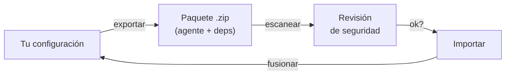

# 08 — Importación, exportación y paquetes

## Tres formas de llevar tu configuración a otro lado

| Forma | Alcance | Incluye secretos? | Portátil | Caso de uso |
|---|---|---|---|---|
| **Vault** | Todo el sistema (agentes, skills, workflows, proyectos, MCPs, reglas, hooks) | No (nombres solo) | Sí, es un repo | Respaldo a un botón, restore en otra máquina |
| **Respaldo en archivo** | Selección manual por secciones | Sí, opcionalmente con un checkbox | No, es local | Copia de seguridad puntual con valores |
| **Paquetes** | Un agente, un workflow o una skill + todas sus dependencias | No (nombres solo) | Sí, es un `.zip` | Compartir configuración reutilizable con otros |

## El Vault: el respaldo del sistema entero, a un botón

El vault es un repositorio git que lleva **TODO** — agentes registrados, skills, reglas, workflows, proyectos, MCPs, bases de saber, ajustes — a GitHub cuando vos apretás **Subir a GitHub**.

**No corre solo, y es a propósito.** Sincronizaba cada 15 minutos y al cerrar la app, y se sacó: el respaldo es un zip y un zip no se diffea, así que cada commit metía el archivo entero de nuevo y el `.git` del vault llegó a 25 GB. Hoy cada respaldo reemplaza al anterior y queda un solo commit. Como nada corre solo, el riel avisa con un punto rojo cuando el último respaldo tiene más de tres días.

Lo que **no entra** al vault: los valores de los secretos (viajan solo los nombres), los hilos de chat, las sesiones en curso, la carpeta TASKS/ de ningún proyecto, ni los adjuntos. El vault es el estado de *qué tienes configurado*, no la historia de lo que hiciste.

Para activar un vault: Configuración → Respaldo del sistema → elegir carpeta. La app sugiere la misma carpeta donde viven tus bases de saber locales, así un solo repo lleva sistema + conocimiento.

Al restaurar en otra máquina (`restore_system` desde el backup zip), todo se fusiona por nombre. Si hay conflictos menores (dos versiones de la misma skill con nombres idénticos), la restauración muestra una diferencia y vos elegís cuál quedarse ([ver F20](../features/20-vault.md)).

## Respaldo en un archivo

Existe un exportador manual (Configuración → Respaldo en un archivo) que genera un JSON con selección por secciones — es la **única forma de incluir valores de secretos**, y con un checkbox explícito "Incluir secretos" para que no sea accidental. Es local, no sube a ningún lado.

## Paquetes: compartir configuración reutilizable

Un **paquete** (`.zip`) contiene un agente, un workflow o una skill, **más todas sus dependencias**:

- Si exportas `@flutter-expert`, el paquete trae el agente + sus skills + sus reglas + los MCPs que tiene asignados + los secretos nombrados (sin valores).
- Si exportas un workflow `tdd`, trae su intención, capacidades, contexto obligatorio, gates, límites de reformulación y política de delegación.
- Si exportas una skill `Flutter patterns`, trae solo la skill.

Un paquete se puede compartir como archivo o como enlace (si lo uploadás a algún lado). Quien lo importa recibe una **revisión de seguridad**: Keel escanea el contenido buscando comandos peligrosos (`rm -rf`, rutas personales hardcodeadas, inyección de prompt, texto invisible, llamadas a internet). Si hay hallazgos graves, el botón de instalar queda desactivado hasta que los reconozcas ([ver F26](../features/26-paquetes.md)).

Lo que los paquetes **no llevan**: valores de secretos (solo nombres) ni nada que sea específico de tu máquina. El que lo importa carga los valores de los secretos con los botones de "Cargar valor" después de la instalación.

## Siguiente paso

Para ver end-to-end cómo se ve el trabajo usando todo esto en conjunto, seguí con [09 — Flujos operativos](09-flujos-operativos.md).
