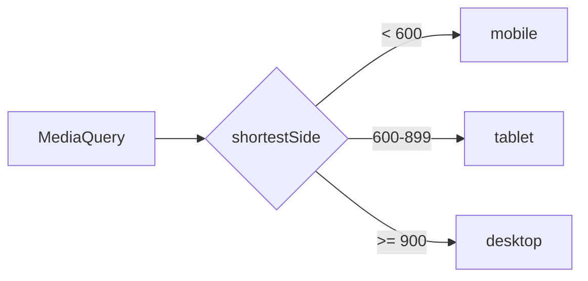

# Device layer

## What has to be done

The complete detail, written for somebody who was not in the conversation this
came out of. If a diagram is needed, it goes here:

## Bloqueantes

Each line is `- [ ] <task path> — <why it blocks>`. The justification is not
decorative: without it nobody knows whether the block still applies. It is marked
with `x` when resolved.

- [ ] 01-descriptive-name/00-other.md — without that there is nothing to build this on

## Acceptance criteria

How it is known to be finished. Verifiable, not "it looks nice".

- [ ] …
